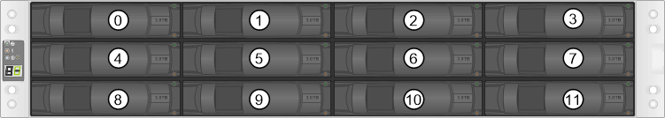
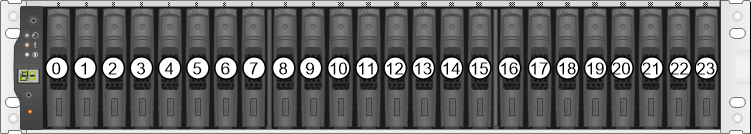
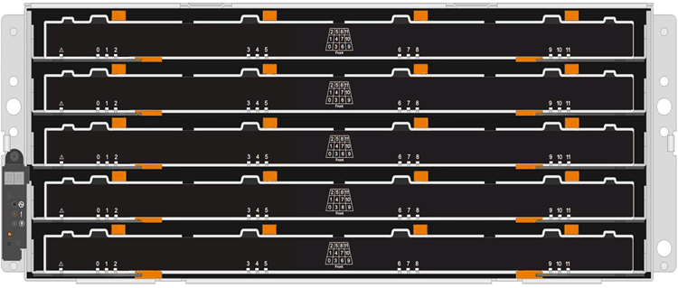
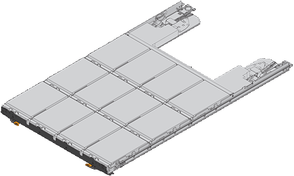

= Requirements for E2800 drive replacement
:icons: font
:imagesdir: ../media/

[.lead]
Before you replace an E2800 drive, review the requirements and considerations.

== Shelf types

You can replace a drive in either a 12-drive, 24-drive, or 60-drive controller shelf or drive shelf.

NOTE: This procedure applies to IOM12 and IOM12B drive shelves as well as DCM and DCM2 drive shelves.

=== 12-drive or 24-drive shelves

The figures show how the drives are numbered in each type of shelf (the shelf's front bezel or end caps have been removed).

*Drive numbering in an E2812 controller shelf or DE212C drive shelf:*

*Drive numbering in an E2824 controller shelf, EF280 flash array, or DE224C drive shelf:*

NOTE: Your E2812, E2824, EF280 storage array might include one or more SAS-2 legacy expansion drive trays, including the DE1600 12-drive tray, the DE5600 24-drive tray, or the DE6600 60-drive tray. For instructions for replacing a drive in one of these drive trays, see link:https://library.netapp.com/ecm/ecm_download_file/ECMLP2577975[Replacing a Drive in E2660, E2760, E5460, E5560, or E5660 Trays^] and link:https://library.netapp.com/ecm/ecm_download_file/ECMLP2577971[Replacing a Drive in E2600, E2700, E5400, E5500, and E5600 12-Drive or 24-Drive Trays^].

=== 60-drive shelves

Both the E2860 controller shelf and the DE460C drive shelf consist of five drive drawers that each contain 12 drive slots. Drive drawer 1 is at the top, and drive drawer 5 is at the bottom.

For both an E2860 controller shelf drawer and a DE460C drive shelf drawer, drives are numbered from 0 to 11 in each drive drawer within the shelf.

image::../media/dwg_trafford_drawer_with_hdds_callouts_maint-e2800.gif[]

NOTE: Your E2860 storage array might include one or more SAS-2 legacy expansion drive trays, including the DE1600 12-drive tray, the DE5600 24-drive tray, or the DE6600 60-drive tray. For instructions for replacing a drive in one of these drive trays, see link:https://library.netapp.com/ecm/ecm_download_file/ECMLP2577975[Replacing a Drive in E2660, E2760, E5460, E5560, or E5660 Trays^] and link:https://library.netapp.com/ecm/ecm_download_file/ECMLP2577971[Replacing a Drive in E2600, E2700, E5400, E5500, and E5600 12-Drive or 24-Drive Trays^].

=== Drive drawer

You can replace a drive drawer in a E2860 controller shelf and a DE460C drive shelf. Each of these 60-drive shelves has five drive drawers.

Each of the five drawers can hold up to 12 drives.

 image:../media/28_dwg_2800_controller_attn_led_maint-e2800.gif[]

== Drive handling

The drives in your storage array are fragile. Improper drive handling is a leading cause of drive failure.

Follow these rules to avoid damaging the drives in your storage array:

* Prevent electrostatic discharge (ESD):
 ** Keep the drive in the ESD bag until you are ready to install it.
 ** Do not insert a metal tool or knife into the ESD bag.
+
Open the ESD bag by hand or cut the top off with a pair of scissors.

 ** Keep the ESD bag and any packing materials in case you must return a drive later.
 ** Always wear an ESD wrist strap grounded to an unpainted surface on your storage enclosure chassis.
+
If a wrist strap is unavailable, touch an unpainted surface on your storage enclosure chassis before handling the drive.
* Handle drives carefully:
 ** Always use two hands when removing, installing, or carrying a drive.
 ** Never force a drive into a shelf, and use gentle, firm pressure to completely engage the drive latch.
 ** Place drives on cushioned surfaces, and never stack drives on top of each other.
 ** Do not bump drives against other surfaces.
 ** Before removing a drive from a shelf, unlatch the handle and wait 30 seconds for the drive to spin down.
 ** Always use approved packaging when shipping drives.
* Avoid magnetic fields:
 ** Keep drives away from magnetic devices.
+
Magnetic fields can destroy all data on the drive and cause irreparable damage to the drive circuitry.
