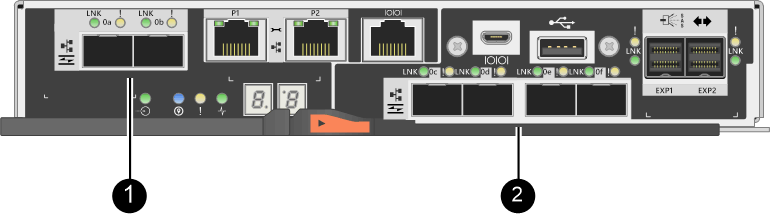
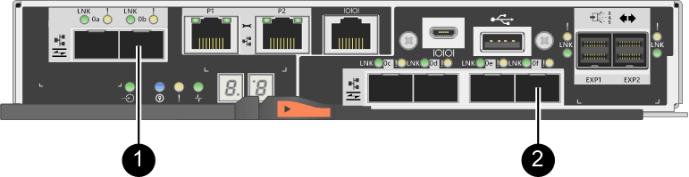

= Requirements to change host port protocol - E2800
:icons: font
:imagesdir: ../media/

[.lead]
Before converting the host protocol for an E2800 array, review the requirements.

== Host ports you can change

NOTE: Only the 16Gb FC/10Gb iSCSI HICs and optical base ports on an E2800 controller are able to be converted.

The following figure shows the back of an E2800 controller that has two SFP+ (optical) baseboard host ports *(1)* and four SFP+ (optical) HIC ports *(2)*.

NOTE: A two-port HIC is also available.

The E2800 controller or controllers in your storage array might have different types of baseboard host ports and different types of HIC ports. The table shows which host ports can be changed with a feature pack.

[options = "header"]
|===
| If you have these baseboard host ports...| And you have these HIC ports... | You can change...
a|
Two SFP+ (optical) ports
a|
None
a|
Only the baseboard host ports
a|
Two SFP+ (optical) ports
a|
Four SFP+ (optical) ports
a|
All of the ports
a|
Two SFP+ (optical) ports
a|
Two SFP+ (optical) ports
a|
All of the ports
a|
Two SFP+ (optical) ports
a|
Two or four SAS ports
a|
Only the baseboard host ports
a|
Two SFP+ (optical) ports
a|
Two RJ-45 (base-T) ports
a|
Only the baseboard host ports
a|
Two RJ-45 (base-T) ports
a|
None
a|
None of the ports
a|
Two RJ-45 (base-T) ports
a|
Two RJ-45 (base-T) ports
a|
None of the ports
|===
The baseboard host ports and the HIC ports can use the same host protocol or different host protocols.

== Requirements for changing the host protocol

* You must schedule a downtime maintenance window for this procedure.
* You must stop host I/O operations when you perform the conversion, and you will not be able to access data on the storage array until you have successfully completed the conversion.
* You must use out-of-band management. (You cannot use in-band management to complete this procedure.)
* You have obtained the necessary hardware for the conversion. Your NetApp Sales Representative can help you determine what hardware you need and help you order the correct parts.
* If you are attempting to change the baseboard host ports of your storage array, and it currently uses dual-protocol (also referred to as _unified_) SFP transceivers that you purchased from NetApp, you do not need to change your SFP transceivers.
* Make sure that the dual-protocol SFP transceivers support both FC (at 4 Gbps, 16 Gbps,) and iSCSI (at 10 Gbps), but they do not support 1 Gbps iSCSI. See link:../maintenance-e2800/hpp-change-host-protocol-task.html[Step 1: Determine whether you have dual-protocol SFPs] to determine what type of SFP transceivers are installed.

== Considerations for changing the host protocol

The considerations for changing the host protocol depend on the starting and ending protocols of the baseboard host ports and the HIC ports.

If you use a Mirroring feature or the Data Assurance (DA) feature, you must understand what happens to these features when you change the host port protocol as described below.

NOTE: The following considerations apply only if you are converting a storage array that has already been in use. These considerations do not apply if you are converting a new storage array that does not yet have hosts and volumes defined.

=== Converting from FC to iSCSI

* If your configuration contains SAN Boot hosts connected to the FC baseboard ports, check the https://mysupport.netapp.com/NOW/products/interoperability[NetApp Interoperability Matrix^] tool to ensure that the configuration is supported on iSCSI. If it is not, you cannot convert the host protocol to iSCSI.
* The DA feature is not supported for iSCSI.
 ** If you are currently using DA and you want to convert FC host ports to iSCSI, you must disable DA on all volumes.
 ** If you do not deactivate DA before converting to iSCSI, the storage array will be out of compliance after the conversion.
* The Synchronous Mirroring feature is not supported for iSCSI.
 ** If you are currently using Synchronous Mirroring relationships and you want to convert FC host ports to iSCSI, you must deactivate Synchronous Mirroring.
 ** Refer to the online help for SANtricity System Manager to remove all synchronous mirrored pairs, which removes mirror relationships on the local storage array and on the remote storage array. In addition, follow the instructions in the online help to deactivate Synchronous Mirroring.
+
CAUTION: If you do not deactivate Synchronous Mirroring relationships before converting to iSCSI, your system will lose data access and data loss might occur.
* Asynchronous Mirroring requires both the local storage array and the remote storage array to use the same protocol.
 ** If you are currently using Asynchronous Mirroring and you want to convert all host ports from FC to iSCSI, you must deactivate Asynchronous Mirroring before applying the feature pack.
 ** Refer to the online help for SANtricity System Manager to delete all mirror consistency groups and remove all mirrored pairs from the local and remote storage arrays. In addition, follow the instructions in the online help to deactivate Asynchronous Mirroring.

=== Converting from iSCSI to FC

* Asynchronous Mirroring requires both the local storage array and the remote storage array to use the same protocol. If you are currently using Asynchronous Mirroring with the baseboard ports, you must deactivate Asynchronous Mirroring before changing the protocol.
* Refer to the online help for SANtricity System Manager to delete all mirror consistency groups and remove all mirrored pairs from the local and remote storage arrays. In addition, follow the instructions in the online help to deactivate Asynchronous Mirroring.

=== Converting from FC to FC/iSCSI

Mirroring considerations:

* Synchronous Mirroring is not supported for iSCSI.
* If a storage array used for mirroring currently has only FC ports, and you want to convert some of them to iSCSI, you must determine which ports are used for mirroring.
* You do not need to convert the ports on the local storage array and the remote storage array to the same protocol as long as both storage arrays have at least one active FC port after the conversion.
* If you plan to convert the ports that are being used for mirrored relationships, you must deactivate any synchronous or asynchronous mirror relationships before applying the feature pack.
* If you plan to convert the ports that are _not_ being used for mirroring, asynchronous mirroring operations will be unaffected.
* Before applying the feature pack, you should confirm that all mirror consistency groups are synchronized. After applying the feature pack, you should test the communication between the local storage array and the remote storage array.

Data Assurance considerations:

* The Data Assurance (DA) feature is not supported for iSCSI.
+
To ensure that data access remains uninterrupted, you might need to remap or remove DA volumes from host clusters before applying the feature pack.
[NOTE]
The Data Assurance feature for iSCSI is supported on SANtricity versions 11.40 and newer.  

+
[options = "header"]
|===
| If you have...| You must...
a|
DA volumes in the default cluster
a|
Remap all the DA volumes in the default cluster.

 * If you do not want to share DA volumes between hosts, follow these steps:
  .. Create a host partition for each set of FC host ports (unless this has already been done).
  .. Remap the DA volumes to the appropriate host ports.
 * If you want to share DA volumes between hosts, follow these steps:
  .. Create a host partition for each set of FC host ports (unless this has already been done).
  .. Create a host cluster that includes the appropriate host ports.
  .. Remap the DA volumes to the new host cluster.
+
NOTE: This approach eliminates volume access to any volumes that remain in the default cluster.

a|
DA volumes in a host cluster that contains FC-only hosts, and you want to add iSCSI-only hosts
a|
Remove any DA volumes belonging to the cluster, using one of these options.

NOTE: DA volumes cannot be shared in this scenario.

 ** If you do not want to share DA volumes between hosts, remap all DA volumes to individual FC hosts within the cluster.
 ** Segregate the iSCSI-only hosts into their own host cluster, and keep the FC host cluster as is (with shared DA volumes).
 ** Add an FC HBA to the iSCSI-only hosts to allow for sharing of both DA and non-DA volumes.

a|
DA volumes in a host cluster that contains FC-only hosts, or DA volumes that are mapped to an individual FC host partition
a|
No action is needed before applying the feature pack. DA volumes will remain mapped to their respective FC host.
a|
No partitions defined
a|
No action is needed before applying the feature pack because no volumes are currently mapped. After converting the host protocol, follow the proper procedure to create host partitions and, if desired, host clusters.
|===

=== Converting from iSCSI to FC/iSCSI

* If you plan to convert a port that is being used for mirroring, you must move the mirroring relationships to a port that will remain iSCSI after the conversion.
+
Otherwise, the communication link might be down after the conversion because of a protocol mismatch between the new FC port on the local array and the existing iSCSI port on the remote array.

* If you plan to convert the ports that are not being used for mirroring, asynchronous mirroring operations will be unaffected.
+
Before applying the feature pack, you should confirm that all mirror consistency groups are synchronized. After applying the feature pack, you should test the communication between the local storage array and the remote storage array.

=== Converting from FC/iSCSI to FC

* When converting all host ports to FC, keep in mind that asynchronous mirroring over FC must occur on the highest-numbered FC port.
* If you plan to convert the ports being used for mirrored relationships, you must deactivate these relationships before applying the feature pack.
+
CAUTION: *Possible data loss* -- If you do not delete the asynchronous mirroring relationships that occurred over iSCSI before converting the ports to FC, the controllers might lock down, and you might lose data.

* If the storage array currently has iSCSI baseboard ports and FC HIC ports, asynchronous mirroring operations will be unaffected.
+
Before and after the conversion, mirroring will occur on the highest-numbered FC port, which will remain the HIC port labeled *2* in the figure. Before applying the feature pack, you should confirm that all mirror consistency groups are synchronized. After applying the feature pack, you should test the communication between the local storage array and the remote storage array.

* If the storage array currently has FC baseboard ports and iSCSI HIC ports, you must delete any mirroring relationships that occur over FC before applying the feature pack.
+
When you apply the feature pack, mirroring support will move from the highest-numbered baseboard host port (labeled *1* in the figure) to the highest-numbered HIC port (labeled *2* in the figure).
+

+
[options = "header"]
|===
3+| Before the conversion 3+| After the conversion .2+| Required steps
| Baseboard ports| HIC ports| Port used for mirroring| Baseboard ports| HIC ports| Port used for mirroring
a|
iSCSI
a|
FC
a|
*(2)*
a|
FC
a|
FC
a|
*(2)*
a|Synchronize mirror consistency groups before and test communications after
a|
FC
a|
iSCSI
a|
*(1)*
a|
FC
a|
FC
a|
*(2)*
a|
Delete mirroring relationships before and re-establish mirroring after
|===

=== Converting from FC/iSCSI to iSCSI

* Synchronous Mirroring is not supported for iSCSI.
* If you plan to convert the ports that are being used for mirrored relationships, you must deactivate mirroring relationships before applying the feature pack.
+
CAUTION: *Possible data loss* -- If you do not delete the mirroring relationships that occurred over FC before converting the ports to iSCSI, the controllers might lock down, and you might lose data.

* If you do not plan to convert the ports that are being used for mirroring, mirroring operations will be unaffected.
* Before applying the feature pack, you should confirm that all mirror consistency groups are synchronized.
* After applying the feature pack, you should test the communication between the local storage array and the remote storage array.

=== Same host protocol and mirroring operations

Mirroring operations are not affected if the host ports being used for mirroring keep the same protocol after you apply the feature pack. Even so, before applying the feature pack, you should confirm that all mirror consistency groups are synchronized.

After applying the feature pack, you should test the communication between the local storage array and the remote storage array. Refer to the online help for SANtricity System Manager if you have questions on how to do this.
