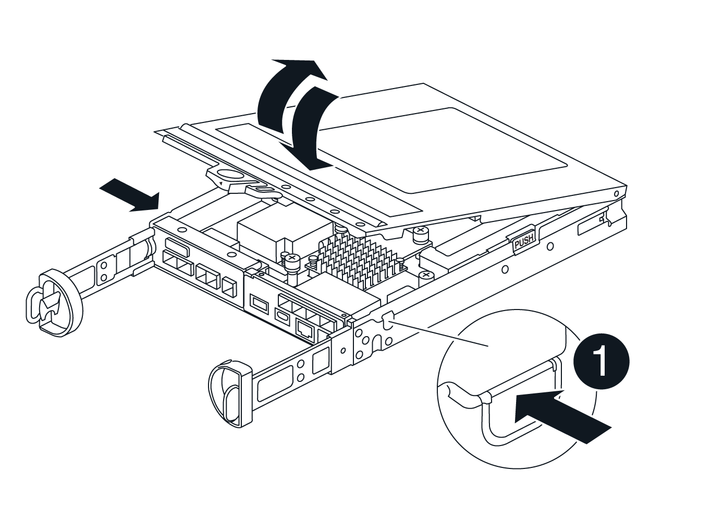

= Replace battery in E4000
:icons: font
:imagesdir: ../media/

[.lead]
You must replace the affected battery in your E4000 appliance if the Recovery Guru in SANtricity System Manager indicates a "Battery Failed" or "Battery Replacement Required" status. To protect your data, the battery must be replaced as soon as possible.

From SANtricity System Manager, review the details in the Recovery Guru to confirm that there is an issue with a battery and to ensure no other items must be addressed first.

.Before you begin

If you plan to replace a failed battery, you must have:

* A replacement battery.
* An ESD wristband, or you have taken other antistatic precautions.
* Labels to identify each cable that is connected to the controller canister.
* A management station with a browser that can access SANtricity System Manager for the controller. (To open the System Manager interface, point the browser to the controller’s domain name or IP address.)
* Verify that no volumes are in use or that you have a multipath driver installed on all hosts using these volumes.

== Step 1: Prepare to replace battery

The steps to prepare for battery replacement depend on whether you have a duplex configuration (two controllers) or a simplex configuration (one controller). 

If you have a duplex configuration, you must place the affected controller offline so you can safely remove the failed battery. The controller that you are not placing offline must be online (in the optimal state).

If you have a simplex configuration, power down the controller shelf so you can safely remove the failed battery.

.Steps

[role="tabbed-block"]
====
.Place controller offline (duplex)
--
. From SANtricity System Manager, review the details in the Recovery Guru to confirm that there is an issue with a battery and to ensure no other items must be addressed first.
. From the Details area of the Recovery Guru, determine which battery to replace.
. Back up the storage array’s configuration database using SANtricity System Manager.
+
If a problem occurs when you remove a controller, you can use the saved file to restore your configuration. The system will save the current state of the RAID configuration database, which includes all data for volume groups and disk pools on the controller.
+
** From System Manager:
+
.. Select *Support › Support Center › Diagnostics*.
.. Select *Collect Configuration Data*.
.. Click *Collect*.
+
The file is saved in the Downloads folder for your browser with the name, *configurationData-<arrayName>-<dateTime>.7z*.
** Alternatively, you can back up the configuration database by using the following CLI command:
+
`save storageArray dbmDatabase sourceLocation=onboard contentType=all file="filename";`
. Collect support data for your storage array using SANtricity System Manager.
. If a problem occurs when you remove a controller, you can use the saved file to troubleshoot the issue. The system will save inventory, status, and performance data about your storage array in a single file.
.. Select *Support › Support Center › Diagnostics*.
.. Select *Collect Support Data*.
.. Click *Collect*.
+
The file is saved in the Downloads folder for your browser with the name, support-data.7z.
. If the controller is not already offline, take it offline now using SANtricity System Manager.
** From SANtricity System Manager:
.. Select *Hardware*.
.. If the graphic shows the drives, select *Show back of shelf* to show the controllers.
.. Select the controller that you want to place offline.
.. From the context menu, select *Place offline*, and confirm that you want to perform the operation.
+
NOTE: If you are accessing SANtricity System Manager using the controller you are attempting to take offline, a SANtricity System Manager Unavailable message is displayed. Select *Connect to an alternate network connection* to automatically access SANtricity System Manager using the other controller.
** Alternatively, you can take the controllers offline by using the following CLI commands:
+
*For controller A*: `set controller [a] availability=offline`
+
*For controller B*: `set controller [b] availability=offline`
. Wait for SANtricity System Manager to update the controller’s status to offline.
. Select *Recheck* from the Recovery Guru, and confirm that the *Okay to remove* field in the *Details* area displays *Yes*. This indicates that it is safe to proceed to removing the controller canister.

--
.Power down the controller shelf (simplex)
--

. Back up the storage array’s configuration database using SANtricity System Manager.
+
If a problem occurs when you remove a controller, you can use the saved file to restore your configuration. The system will save the current state of the RAID configuration database, which includes all data for volume groups and disk pools on the controller.

** From System Manager:
.. Select *Support › Support Center › Diagnostics*.
.. Select *Collect Configuration Data*.
.. Click *Collect*.
+
The file is saved in the Downloads folder for your browser with the name, *configurationData-<arrayName>-<dateTime>.7z*.
** Alternatively, you can back up the configuration database by using the following CLI command:
+
`save storageArray dbmDatabase sourceLocation=onboard contentType=all file="filename";`
. Collect support data for your storage array using SANtricity System Manager.
+
If a problem occurs when you remove a controller, you can use the saved file to troubleshoot the issue. The system will save inventory, status, and performance data about your storage array in a single file.

.. Select *Support › Support Center › Diagnostics*.
.. Select *Collect Support Data*.
.. Click *Collect*.
+
The file is saved in the Downloads folder for your browser with the name, *support-data.7z*.
. Ensure that no I/O operations are occurring between the storage array and all connected hosts. For example, you can perform these steps:
.. Stop all processes that involve the LUNs mapped from the storage to the hosts.
.. Ensure that no applications are writing data to any LUNs mapped from the storage to the hosts.
.. Unmount all file systems associated with volumes on the array.
+
NOTE: The exact steps to stop host I/O operations depend on the host operating system and the configuration, which are beyond the scope of these instructions. If you are not sure how to stop host I/O operations in your environment, consider shutting down the host.
+
CAUTION: *Possible data loss*--If you continue this procedure while I/O operations are occurring, you might lose data.

. Wait for any data in cache memory to be written to the drives.
+
The green Cache Active LED on the back of the controller is on when cached data needs to be written to the drives. You must wait for this LED to turn off.
. From the home page of SANtricity System Manager, select *View Operations in Progress*.
. Confirm that all operations have completed before continuing with the next step.
. Turn off both power switches on the controller shelf.
. Wait for all LEDs on the controller shelf to turn off.

--

====

== Step 2: Remove E4000 controller canister

You need to remove the controller canister from the controller shelf, so you can remove the battery.

.Before you begin

Make sure you have the following:

* An ESD wristband, or you have taken other antistatic precautions.
* Labels to identify each cable that is connected to the controller canister.

.Steps

. Disconnect all the cables from the controller canister.
+
CAUTION: To prevent degraded performance, do not twist, fold, pinch, or step on the cables.

. If the host ports on the controller canister use SFP+ transceivers, leave them installed.
. Confirm that the Cache Active LED on the back of the controller is off.
. Squeeze the latch on the cam handle until it releases, open the cam handle fully to release the controller canister from the midplane, and then, using two hands, pull the controller canister half-way out of the chassis.
. Check the NVMEM LED located on the back of the controller canister. Look for the NV icon.
+
NOTE: The green NV LED on the faceplate will start flashing when power is removed from the controller if the system was in the "waiting for giveback" state, or the system was not taken over or halted properly (uncommitted data). If the impaired controller canister was not successfully taken over by the partner controller canister, contact NetApp Support

** If the green NV status LED begins flashing when the controller canister is removed from the chassis:
*** Confirm that the controller had a clean takeover by the partner controller canister or the impaired controller shows waiting for giveback, the flashing LED can be ignored and you can complete removing the impaired controller from the chassis.
** If the green NV LED if off, you can complete removing the impaired controller from the chassis.

== Step 3: Install the new battery

You must remove the failed battery and replace it.

.Steps

. Unpack the new battery and place it on a flat, static-free surface.
+
NOTE: To comply with IATA safely regulations, replacement batteries are shipped with a state of charge (SoC) of 30 percent or less. When you reapply power, keep in mind that write caching will not resume until the replacement battery is fully charged and it has completed its initial learn cycle.
. If you are not already grounded, properly ground yourself.
. Remove the controller canister from the chassis.
. Turn the controller canister over and place it on a flat, stable surface.
. Open the cover by pressing the blue buttons on the sides of the controller canister to release the cover, and then rotate the cover up and off of the controller canister.
+

. Locate the battery in the controller canister.
. Remove the failed battery from the controller canister:
.. Press the blue button on the side of the controller canister.
.. Slide the battery up until it clears the holding brackets, and then lift the battery out of the controller canister.
.. Unplug the battery from the controller canister.
+
image::../media/drw_E4000_replace_nvbattery_IEOPS-862.png[Remove NVMEM battery.]
+
|===
a|image::../media/legend_icon_01.png[] |Battery release tab
a|
image::../media/legend_icon_02.png[]
|Battery power connector
|===
. Remove the replacement battery from its package. Install the replacement battery:
.. Plug the battery plug back into the socket on the controller canister.
+
Make sure that the plug locks down into the battery socket on the motherboard.
.. Align the battery with the holding brackets on the sheet metal side wall.
.. Slide the battery pack down until the battery latch engages and clicks into the opening on the side wall.
. Reinstall the controller canister cover and lock it into place.

== Step 4: Reinstall the controller canister

After you replace components in the controller canister, reinstall it into the chassis.

.Steps

. If you are not already grounded, properly ground yourself.
. If you have not already done so, replace the cover on the controller canister.
. Turn the controller canister over and align the end with the opening in the chassis.
. Align the end of the controller canister with the opening in the chassis, and then gently push the controller canister halfway into the system.
+
NOTE: Do not completely insert the controller canister in the chassis until instructed to do so.
. Recable the system, as needed.
. If you removed the media converters (QSFPs or SFPs), remember to reinstall them if you are using fiber optic cables.
. Complete the reinstallation of the controller canister:
.. With the cam handle in the open position, firmly push the controller canister in until it meets the midplane and is fully seated, and then close the cam handle to the locked position.
+
NOTE: Do not use excessive force when sliding the controller canister into the chassis to avoid damaging the connectors.
+
The controller begins to boot as soon as it is seated in the chassis.
.. If you have not already done so, reinstall the cable management device.
.. Bind the cables to the cable management device with the hook and loop strap.

== Step 5: Complete battery replacement

The steps to complete battery replacement depend on whether you have a duplex (two controllers) or simplex (one controller) configuration.

.Steps

[role="tabbed-block"]
====
.Place controller online (duplex)
--

. Bring the controller online using SANtricity System Manager.

** From SANtricity System Manager:
.. Select *Hardware*.
.. If the graphic shows the drives, select *Show back of shelf*.
.. Select the controller you want to place online.
.. Select *Place Online* from the context menu, and confirm that you want to perform the operation.
+
The system places the controller online.

** Alternatively, you can bring the controller back online by using the following CLI commands:
+
*For controller A*: `set controller [a] availability=online`;
+
*For controller B*: `set controller [b] availability=online`;

. When the controller is back online, check the controller shelf's Attention LEDs.
+
If the status is not Optimal or if any of the Attention LEDs are on, confirm that all cables are correctly seated, and check that the battery and the controller canister are installed correctly. If necessary, remove and reinstall the controller canister and the battery.
+
NOTE: If you cannot resolve the problem, contact technical support.
If needed, collect support data for your storage array using SANtricity System Manager.
. Verify that all volumes have been returned to the preferred owner.
.. Select *Storage › Volumes*. From the *All Volumes* page, verify that volumes are distributed to their preferred owners. Select *More › Change ownership* to view volume owners.
.. If volumes are all owned by preferred owner continue to step 5.
.. If none of the volumes are returned, you must manually return the volumes. Go to *More › Redistribute volumes*.
.. If only some of the volumes are returned to their preferred owners after auto-distribution or manual distribution, you must check the Recovery Guru for host connectivity issues.
.. If there is no Recovery Guru present or if after following the recovery guru steps the volumes are still not returned to their preferred owners, contact support.
. Collect support data for your storage array using SANtricity System Manager.
.. Select *Support › Support Center › Diagnostics*.
.. Select Collect Support Data.
.. Click Collect.
+
The file is saved in the Downloads folder for your browser with the name, support-data.7z.

.What's next?
Your battery replacement is complete. You can resume normal operations.

--
.Power up controller (simplex)
--

. Turn on the two power switches at the back of the controller shelf.

** Do not turn off the power switches during the power-on process, which typically takes 90 seconds or less to complete.
** The fans in each shelf are very loud when they first start up. The loud noise during start-up is normal.

. When the controller is back online, check the controller shelf's Attention LEDs.
+
If the status is not Optimal or if any of the Attention LEDs are on, confirm that all cables are correctly seated, and check that the battery and the controller canister are installed correctly. If necessary, remove and reinstall the controller canister and the battery.
+
NOTE: If you cannot resolve the problem, contact technical support.
If needed, collect support data for your storage array using SANtricity System Manager.
. Verify that all volumes have been returned to the preferred owner.
.. Select *Storage › Volumes*. From the *All Volumes* page, verify that volumes are distributed to their preferred owners. Select *More › Change ownership* to view volume owners.
.. If volumes are all owned by preferred owner continue to step 5.
.. If none of the volumes are returned, you must manually return the volumes. Go to *More › Redistribute volumes*.
.. If only some of the volumes are returned to their preferred owners after auto-distribution or manual distribution, you must check the Recovery Guru for host connectivity issues.
.. If there is no Recovery Guru present or if after following the recovery guru steps the volumes are still not returned to their preferred owners, contact support.
. Collect support data for your storage array using SANtricity System Manager.
.. Select *Support › Support Center › Diagnostics*.
.. Select Collect Support Data.
.. Click Collect.
+
The file is saved in the Downloads folder for your browser with the name, *support-data.7z*.

.What's next?
Your battery replacement is complete. You can resume normal operations.
--

====