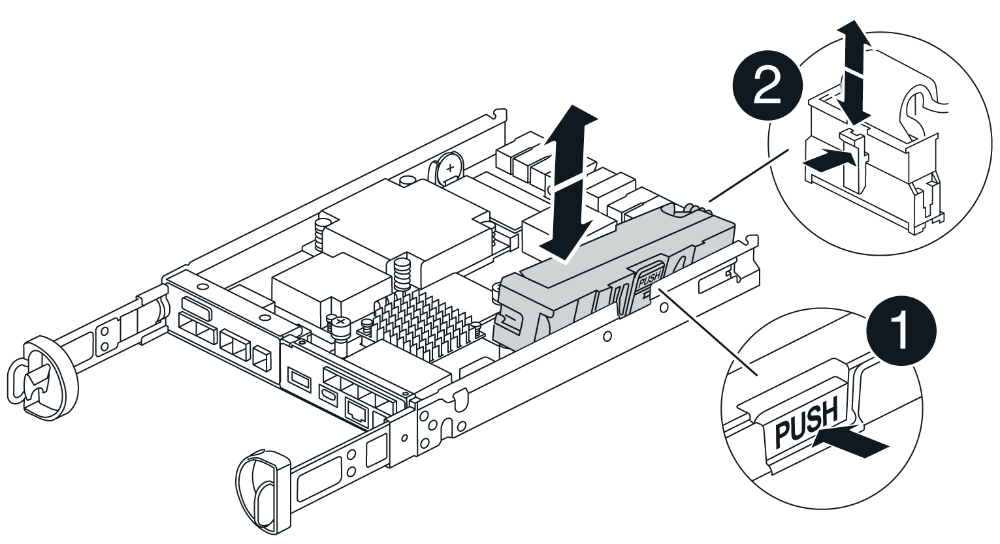
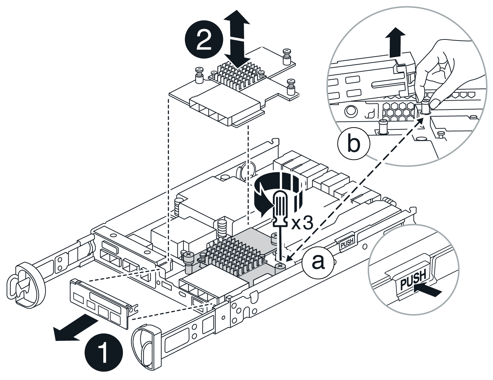
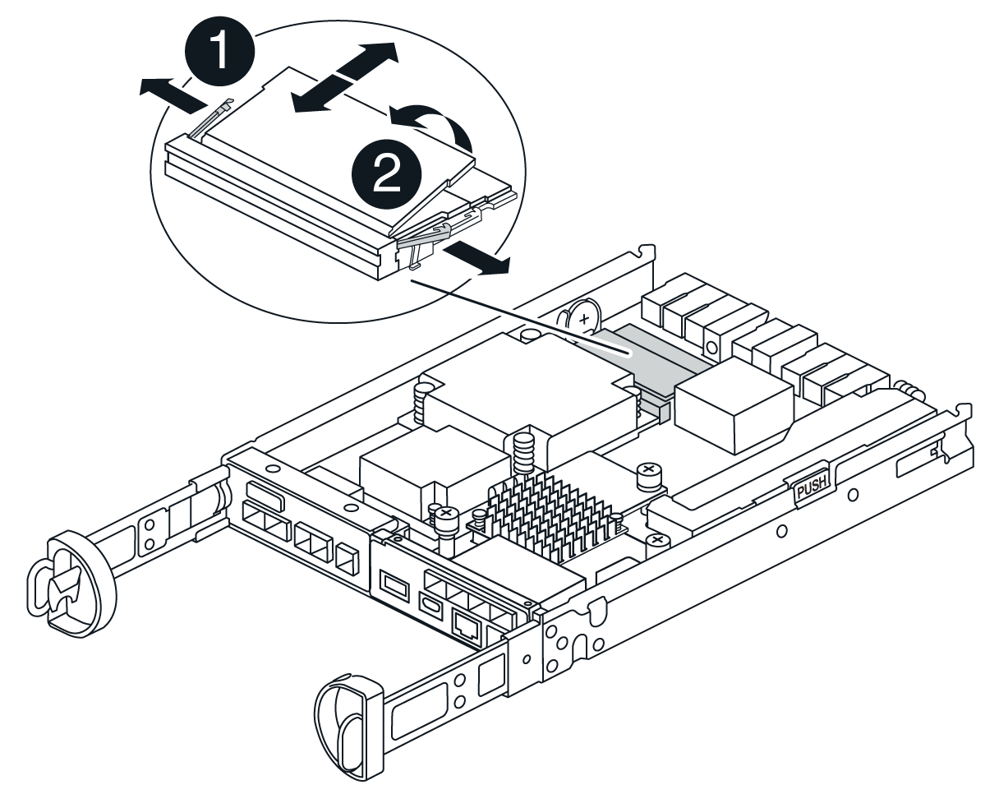

= Replace controller in E4000
:icons: font
:imagesdir: ../media/

[.lead]
You can replace a failed controller canister.

.Before you begin

Make sure you have the following:

* A replacement controller canister with the same part number as the controller canister you are replacing.
* An ESD wristband, or you have taken other antistatic precautions.
* Labels to identify each cable that is connected to the controller canister.
* #1 Phillips screwdriver.
* A management station with a browser that can access SANtricity System Manager for the controller. (To open the System Manager interface, point the browser to the controller's domain name or IP address.)

== Step 1: Prepare to replace controller

Prepare to replace a controller canister by saving the drive security key, backing up the configuration, and collecting support data. Then, you can stop host I/O operations and place the controller offline or power it down.

[role="tabbed-block"]
====
.Power down the controller shelf (simplex)
--

.Steps

. If possible, make a note of which version of SANtricity OS software is currently installed on the controller. Open SANtricity System Manager and select *Support › Upgrade Center › View Software and Firmware Inventory*.
. If the Drive Security feature is enabled, be sure a saved key exists and that you know the pass phrase required to install it.
+
CAUTION: *Possible loss of data access* — If all drives in the storage array are security enabled, the new controller will not be able to access the storage array until you unlock the secured drives using the Enterprise Management Window in SANtricity Storage Manager.
+
To save the key (might not be possible, depending on the state of the controller):

.. From SANtricity System Manager, select *Settings › System*.
.. Under *Drive security key management*, select *Back Up Key*.
.. In the *Define a pass phrase/Re-enter pass phrase* fields, enter and confirm a pass phrase for this backup copy.
.. Click *Backup*.
.. Record your key information in a secure location, and then click *Close*.

. Back up the storage array's configuration database using SANtricity System Manager.
+
If a problem occurs when you remove a controller, you can use the saved file to restore your configuration. The system will save the current state of the RAID configuration database, which includes all data for volume groups and disk pools on the controller.

** From System Manager:

.. *Select Support › Support Center › Diagnostics*.
.. Select *Collect Configuration Data*.
.. Click *Collect*.
+
The file is saved in the Downloads folder for your browser with the name, *configurationData-<arrayName>-<dateTime>.7z*.

** Alternatively, you can back up the configuration database by using the following CLI command:
+
`save storageArray dbmDatabase sourceLocation=onboard contentType=all file="filename";`

. Collect support data for your storage array using SANtricity System Manager.
+
If a problem occurs when you remove a controller, you can use the saved file to troubleshoot the issue. The system will save inventory, status, and performance data about your storage array in a single file.

.. *Select Support › Support Center › Diagnostics*.
.. Select *Collect Support Data*.
.. Click *Collect*.
+
The file is saved in the Downloads folder for your browser with the name, *support-data.7z*.
. Ensure that no I/O operations are occurring between the storage array and all connected hosts. For example, you can perform these steps:

** Stop all processes that involve the LUNs mapped from the storage to the hosts.
** Ensure that no applications are writing data to any LUNs mapped from the storage to the hosts.
** Unmount all file systems associated with volumes on the array.
+
NOTE: The exact steps to stop host I/O operations depend on the host operating system and the configuration, which are beyond the scope of these instructions. If you are not sure how to stop host I/O operations in your environment, consider shutting down the host.
+
CAUTION: *Possible data loss* — If you continue this procedure while I/O operations are occurring, you might lose data.

. Wait for any data in cache memory to be written to the drives.
+
The green Cache Active LED on the back of the controller is on when cached data needs to be written to the drives. You must wait for this LED to turn off.
. From the home page of SANtricity System Manager, select *View Operations in Progress*.
. Confirm that all operations have completed before continuing with the next step.
. Turn off both power switches on the controller shelf.
. Wait for all LEDs on the controller shelf to turn off.
. Select *Recheck* from the Recovery Guru, and confirm that the *OK to remove* field in the Details area displays *Yes*, indicating that it is safe to remove this component.
Data on the storage array will not be accessible until you replace the controller canister.
--

.Place controller offline (duplex)
--

.Steps

. Unpack the new controller canister, and set it on a flat, static-free surface.
+
Save the packing materials to use when shipping the failed controller canister.
. Locate the MAC address and FRU part number labels on the back of the controller canister.
. From SANtricity System Manager, locate the replacement part number for the controller canister you are replacing.
+
When a controller has a fault and needs to be replaced, the replacement part number is displayed in the Details area of the Recovery Guru. If you need to find this number manually, follow these steps:

.. Select *Hardware*.
.. Locate the controller shelf, which is marked with the controller icon.
.. Click the controller icon.
.. Select the controller, and click *Next*.
.. On the *Base* tab, make a note of the *Replacement Part Number* for the controller.
. Confirm that the replacement part number for the failed controller is the same as the FRU part number for the replacement controller.
+
CAUTION: *Possible loss of data access* — If the two part numbers are not the same, do not attempt this procedure. The presence of mismatched controllers will cause the new controller to lock down when you bring it online.
. Back up the storage array's configuration database using SANtricity System Manager.
+
If a problem occurs when you remove a controller, you can use the saved file to restore your configuration. The system will save the current state of the RAID configuration database, which includes all data for volume groups and disk pools on the controller.

** From System Manager:
.. Select *Support › Support Center › Diagnostics*.
.. Select *Collect Configuration Data*.
.. Click *Collect*.
+
The file is saved in the Downloads folder for your browser with the name, *configurationData-<arrayName>-<dateTime>.7z*.

** Alternatively, you can back up the configuration database by using the following CLI command:
+
----
save storageArray dbmDatabase sourceLocation=onboard contentType=all file="filename";
----

. If the controller is not already offline, take it offline now using SANtricity System Manager.

** From SANtricity System Manager:
.. Select *Hardware*.
.. If the graphic shows the drives, select *Show back of shelf* to show the controllers.
.. Select the controller that you want to place offline.
.. From the context menu, select *Place offline*, and confirm that you want to perform the operation.
+
NOTE: If you are accessing SANtricity System Manager using the controller you are attempting to take offline, a SANtricity System Manager Unavailable message is displayed. Select Connect to an alternate network connection to automatically access SANtricity System Manager using the other controller.

** Alternatively, you can take the controllers offline by using the following CLI commands:
+
*For controller A*: `set controller [a] availability=offline`
+
*For controller B*: `set controller [b] availability=offline`
. Wait for SANtricity System Manager to update the controller's status to offline.
+
CAUTION: Do not begin any other operations until after the status has been updated.
. Select *Recheck* from the Recovery Guru, and confirm that the *OK to remove* field in the Details area displays *Yes*, indicating that it is safe to remove this component.

--
====

== Step 2: Remove failed controller

Replace the failed canister with a new one.

.Steps

. Remove a controller canister.
.. Put on an ESD wristband or take other antistatic precautions.
.. Label each cable that is attached to the controller canister.
.. Disconnect all the cables from the controller canister.
+
CAUTION: To prevent degraded performance, do not twist, fold, pinch, or step on the cables.
.. If needed, remove the SFPs transceivers.
.. Confirm that the Cache Active LED on the back of the controller is off.
+
The green Cache Active LED on the back of the controller is on when cached data needs to be written to the drives. You must wait for this LED to turn off before removing the controller canister.
.. Squeeze the latch on the cam handle until it releases, open the cam handle fully to release the controller canister from the midplane, and then, using two hands, pull the controller canister out of the chassis.
.. Turn the controller canister over and place it on a flat, stable surface.
.. Open the cover by pressing the blue buttons on the sides of the controller canister to release the cover, and then rotate the cover up and off of the controller canister.

== Step 3: Remove the battery

Remove the battery from the impaired controller and install it in the replacement controller.

.Steps

. Remove the battery from the controller canister:
.. Press the blue button on the side of the controller canister.
.. Slide the battery up until it clears the holding brackets, and then lift the battery out of the controller canister.
.. Unplug the battery plug by squeezing the clip on the face of the battery plug to release the plug from the socket, and then unplug the battery cable from the socket.
+

+
|===
a|image::../media/legend_icon_01.png[One icon] |Battery release tab
a|

|Battery power connector
|===
. Move the battery to the replacement controller canister and install it:
.. Aligning the battery with the holding brackets on the sheet metal side wall.
.. Slide the battery pack down until the battery latch engages and clicks into the opening on the side wall.
+
NOTE: Do not plug the battery in yet. You will plug it in once the rest of the components are moved to the replacement controller canister.

== Step 4: Remove the HIC

Remove the HIC bezel and PCIe HIC card from the impaired controller module.

.Steps

. Remove the HIC bezel by sliding it straight out from the controller module.
+

. Loosen the thumbscrews on the HIC.
+
NOTE: You can loosen the thumbscrews with your fingers or a screwdriver.
. Lift the HIC straight up and set it aside on an anti-static surface.

== Step 5: Move the DIMMs

Remove the DIMMs from the impaired controller canister and install them into the replacement controller canister.

.Steps

. Locate the DIMMs on your controller canister.
+
NOTE: Note the location of the DIMM in the sockets so that you can insert the DIMM in the same location in the replacement controller canister and in the proper orientation.
Remove the DIMMs from the impaired controller canister:

.. Eject the DIMM from its slot by slowly pushing apart the two DIMM ejector tabs on either side of the DIMM.
+
The DIMM will rotate up a little.

.. Rotate the DIMM as far as it will go, and then slide the DIMM out of the socket.
+
NOTE: Carefully hold the DIMM by the edges to avoid pressure on the components on the DIMM circuit board.
+

+
|===
a|image::../media/legend_icon_01.png[One icon] |DIMM ejector tabs
a|

|DIMMS
|===
. Verify that the battery is not plugged into the replacement controller canister.
. Install the DIMMs in the replacement controller in the same place they were in the impaired controller:
.. Push carefully, but firmly, on the top edge of the DIMM until the ejector tabs snap into place over the notches at the ends of the DIMM.
+
The DIMM fits tightly in the slot, but should go in easily. If not, realign the DIMM with the slot and reinsert it.
+
NOTE: Visually inspect the DIMM to verify that it is evenly aligned and fully inserted into the slot.
. Repeat these steps for the other DIMM.

== Step 6: Install the HIC

Install the HIC into the replacement controller canister.

.Steps

. Align the socket on the replacement HIC plug with the socket on the motherboard, and then gently seat the card squarely into the socket.
. Tighten the three thumbscrews on the HIC.
. Reinstall the HIC faceplate.

== Step 7: Install the battery

Install the battery into the replacement controller canister.

.Steps

. Plug the battery plug back into the socket on the controller canister.
+
Make sure that the plug locks down into the battery socket on the motherboard.
. Aligning the battery with the holding brackets on the sheet metal side wall.
. Slide the battery pack down until the battery latch engages and clicks into the opening on the side wall.
. Reinstall the controller canister cover and lock it into place.

== Step 8: Complete controller replacement

Reestablish connection to the controller shelf, collect support data, and resume operations.

[role="tabbed-block"]
====
.Power on controller shelf (simplex)
--

.Steps

. Install the replacement controller into the appliance.
 .. Turn the controller over, so that the removable cover faces down.
 .. With the cam handle in the open position, slide the controller all the way into the appliance.
 .. Move the cam handle to the left to lock the controller in place.
 .. Replace the cables.
 .. Power on the controller shelf.
 .. Wait for the E4000 controller to reboot.
 .. Determine how you will assign an IP address to the replacement controller.
+
NOTE: The steps for assigning an IP address to the replacement controller depend on whether you connected the management port to a network with a DHCP server and on whether all drives are secured.
+
If management port 1 is connected to a network with a DHCP server, the new controller will obtain its IP address from the DHCP server. This value might be different than the original controller's IP address.

. If the storage array has secure drives, import the drive security key; otherwise, go to the next step. Follow the appropriate procedure below for a storage array with all secure drives or a mix of secure and unsecure drives.
+
NOTE: _Unsecure drives_ are unassigned drives, global hot spare drives, or drives that are part of a volume group or a pool that is not secured by the Drive Security feature. Secure drives are assigned drives that are a part of a secured volume group or disk pool using Drive Security.

** *Only secured drives (no unsecure drives)*:
.. Access the storage array's command line interface (CLI).
.. Load the appropriate simplex NVSRAM on the controller.
+
For example: `download storageArray NVSRAM file=\"N4000-881834-SG4.dlp\" forceDownload=TRUE;`
.. Confirm that the controller is *Optimal* after loading simplex NVSRAM.
.. If using external security key management, https://docs.netapp.com/us-en/e-series/upgrade-controllers/upgrade-unlock-drives-task.html#external-key-management[setup external key management on the controller].
.. If using internal security key management, enter the following command to import the security key:
+
----
import storageArray securityKey file="C:/file.slk"
passPhrase="passPhrase";
----
+
where:

*** `C:/file.slk` represents the directory location and name of your drive security key
*** `passPhrase` is the pass phrase needed to unlock the file After the security key has been imported, the controller reboots, and the new controller adopts the saved settings for the storage array.

.. Go to the next step to confirm that the new controller is Optimal.

** *Mix of secure and unsecure drives*:

.. Collect the support bundle and open the storage array profile.
.. Find and record all the unsecure drives’ locations, which are found in the support bundle.
.. Power off the system.
.. Remove the unsecure drives.
.. Replace the controller.
.. Power on the system.
.. From SANtricity System Manager, select *Settings › System*.
.. In the Security Key Management section, select *Create/Change Key* to create a new security key.
.. Select *Unlock Secure Drives* to import the security key you saved.
.. Run the `set allDrives nativeState` CLI command.
.. The controller will reboot automatically.
.. Wait for the controller to boot up and for the seven-segment display to show the tray number or a flashing L5.
.. Power off the system.
.. Reinstall the unsecure drives.
.. Reset the controller using SANtricity System Manager.
.. Power on the system and wait for the seven-segment display to show the tray number.
.. Go to the next step to confirm that the new controller is Optimal.

. From SANtricity System Manager, confirm that the new controller is Optimal.
.. Select *Hardware*.
.. For the controller shelf, select *Show back of shelf*.
.. Select the controller canister you replaced.
.. Select *View settings*.
.. Confirm that the controller's *Status* is Optimal.
.. If the status is not Optimal, highlight the controller, and select *Place Online*.

. Collect support data for your storage array using SANtricity System Manager.
.. Select *Support › Support Center › *Diagnostics*.
.. Select *Collect Support Data*.
.. Click *Collect*.
+
The file is saved in the Downloads folder for your browser with the name, *support-data.7z*.

--

.Place controller online (duplex)
--

.Steps

. Install the replacement controller into the appliance.
 .. Turn the controller over, so that the removable cover faces down.
 .. With the cam handle in the open position, slide the controller all the way into the appliance.
 .. Move the cam handle to the left to lock the controller in place.
 .. Replace the cables.
 .. If the original controller used DHCP for the IP address, locate the MAC address on the label on the back of the replacement controller. Ask your network administrator to associate the DNS/network and IP address for the controller you removed with the MAC address for the replacement controller.
+
NOTE: If the original controller did not use DHCP for the IP address, the new controller will adopt the IP address of the controller you removed.
. Place controller online.
.. In System Manager, navigate to the *Hardware* page.
.. Select *Show back of controller*.
.. Select the replaced controller.
.. Select *Place online* from the drop-down list.
. As the controller boots, check the controller LEDs.

** The amber Attention LED on the controller turns on and then turns off, unless there is an error.
** The Host Link LEDs might be on, blinking, or off, depending on the host interface.

. When the controller is back online, confirm that its status is Optimal and check the controller shelf's Attention LEDs.
+
If the status is not Optimal or if any of the Attention LEDs are on, confirm that all cables are correctly seated and the controller canister is installed correctly. If necessary, remove and reinstall the controller canister.
+
NOTE: If you cannot resolve the problem, contact technical support.
. If required, redistribute all volumes back to their preferred owner using SANtricity System Manager.
.. Select *Storage › Volumes*.
.. Select *More › Redistribute volumes*.
. Click *Hardware › Support › Upgrade Center* to ensure that the latest version of SANtricity OS software (controller firmware) is installed.
+
As needed, install the latest version.

. Collect support data for your storage array using SANtricity System Manager.
.. Select *Support › Support Center › Diagnostics*.
.. Select *Collect Support Data*.
.. Click *Collect*.
+
The file is saved in the Downloads folder for your browser with the name, *support-data.7z*.

--
====

.What's next?
Your controller replacement is complete. You can resume normal operations.