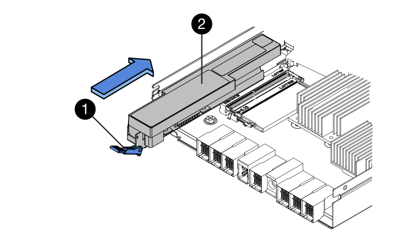

= Replace battery
:icons: font
:imagesdir: ../media/

[.lead]
Each controller canister includes a battery that preserves cached data if the AC power fails. If the Recovery Guru in SANtricity System Manager reports either a Battery Failed status or a Battery Replacement Required status, you must replace the affected battery.

== Step 1: Place controller offline (duplex)

[.lead]
If you have a duplex configuration, you must place the affected controller offline so you can safely remove the failed battery. You must back up the configuration and collect support data first. Then, you can take the affected controller offline.

===== Before You Begin

* Your storage array must have two controllers. The controller that you are not placing offline must be online (in the optimal state).
* You have verified that no volumes are in use or that you have a multipath driver installed on all hosts using these volumes.

Perform this task only if your storage array has two controllers (duplex configuration).

===== Steps

. From SANtricity System Manager, review the details in the Recovery Guru to confirm that there is an issue with a battery and to ensure no other items must be addressed first.
. From the Details area of the Recovery Guru, determine which battery to replace.
. Back up the storage array's configuration database.
+
If a problem occurs when you remove a controller, you can use the saved file to restore your configuration.

 .. Open the Enterprise Management Window (EMW) for SANtricity Storage Manager on your management station.
 .. Select the storage array.
 .. Select *Tools* > *Execute Script*.
 .. Type the following command in the text box.
+
----
save storageArray dbmDatabase sourceLocation=onboard contentType=all file="filename";
----
+
In this command, filename is the file path and file name to which you want to save the database. Enclose the file name in double quotation marks (" "). For example:
+
----
 file="C:\Program Files\CLI\logs\dbmdata.zip"
----
+
This command does not automatically append a file extension to the saved file. You must specify a file extension when entering the file name.

 .. Select *Tools* > *Verify and Execute*.

. Collect support data for your storage array using SANtricity System Manager.
 .. Select *Support* > *Support Center* > *Diagnostics*.
 .. Select *Collect Support Data*.
 .. Click *Collect*.
The file is saved in the Downloads folder for your browser with the name support-data.7z.
. If the controller is not already offline, take it offline now using either SANtricity System Manager or the Enterprise Management Window's (EMW) script editor:
 ** To use SANtricity System Manager:
  ... Select *Hardware*.
  ... If the graphic shows the drives, select *Show back of shelf* to show the controllers.
  ... Select the controller that you want to place offline.
  ... From the context menu, select *Place offline*, and confirm that you want to perform the operation.
*Note:* If you are accessing SANtricity System Manager using the controller you are attempting to take offline, a SANtricity System Manager Unavailable message is displayed. Select *Connect to an alternate network connection* to automatically access SANtricity System Manager using the other controller.
 ** To use script editor in the EMW:
  ... Open the Enterprise Management Window (EMW) in SANtricity Storage Manager on your local host.
  ... Select the storage array.
  ... Select *Tools* > *Execute Script*.
  ... Type one of the following commands in the text box.
+
----
**For controller A:** set controller [a] availability=offline
----
+
----
**For controller B:** set controller [b] availability=offline
----

  ... Select *Tools* > *Verify and Execute*.
The system attempts to take the controller offline.
. Wait for SANtricity System Manager to update the controller's status to offline.
+
IMPORTANT: Do not begin any other operations until after the status has been updated.

== Step 2: Remove controller canister

[.lead]
When you remove a controller canister, you must disconnect all cables. Then, you can slide the controller canister out of the controller shelf.

===== Steps

. Put on an ESD wristband or take other antistatic precautions.
. Label each cable that is attached to the controller canister.
. Disconnect all of the cables from the controller canister.
+
IMPORTANT: To prevent degraded performance, do not twist, fold, pinch, or step on the cables.

. If the host ports on the controller canister use SFP+ transceivers, leave them installed.
. Confirm that the Cache Active LED on the back of the controller is off.
. Squeeze the latch on the cam handle until it releases, and then open the cam handle to the right to release the controller canister from the shelf.
+
The following figure is an example of an E5724 controller shelf:
+
image::../media/28_dwg_e2824_remove_controller_canister_maint-e5700.gif[]
+
image:../media/legend_icon_01_maint-e5700.gif[] Controller canister image:../media/legend_icon_02_maint-e5700.gif[] Cam handle
+
The following figure is an example of an E5760 controller shelf:
+
image::../media/28_dwg_e2860_add_controller_canister_maint-e5700.gif[]
+
image:../media/legend_icon_01_maint-e5700.gif[] Controller canister image:../media/legend_icon_02_maint-e5700.gif[] Cam handle

. Using two hands and the cam handle, slide the controller canister out of the shelf.
+
IMPORTANT: Always use two hands to support the weight of a controller canister.
+
If you are removing the controller canister from an E5724 controller shelf, a flap swings into place to block the empty bay, helping to maintain air flow and cooling.

. Turn the controller canister over, so that the removable cover faces up.
. Place the controller canister on a flat, static-free surface.

== Step 3: Remove failed battery

[.lead]
After removing the controller canister from the controller shelf, you can remove the battery.

===== Steps

. Remove the controller canister's cover by pressing down on the button and sliding the cover off.
. Confirm that the green LED inside the controller (between the battery and the DIMMs) is off.
+
If this green LED is on, the controller is still using battery power. You must wait for this LED to go off before removing any components.
+
image::../media/28_dwg_e2800_internal_cache_active_led_maint-e5700.gif[]
+
image:../media/legend_icon_01_maint-e5700.gif[] Internal Cache Active LED image:../media/legend_icon_02_maint-e5700.gif[] Battery

. Locate the blue release latch for the battery.
. Unlatch the battery by pushing the release latch down and away from the controller canister.
+
image::../media/28_dwg_e2800_remove_battery_maint-e5700.gif[]
+
image:../media/legend_icon_01_maint-e5700.gif[]Battery release latch image:../media/legend_icon_02_maint-e5700.gif[] Battery

. Lift up on the battery, and slide it out of the controller canister.
. Follow the appropriate procedures for your location to recycle or dispose of the failed battery.
+
WARNING: To comply with International Air Transport Association (IATA) regulations, never ship a lithium battery by air unless it is installed within the controller shelf.

== Step 4: Install new battery

[.lead]
Install a new battery when the old one has failed.

===== Before You Begin

* You have the failed battery from the controller canister.
* You have the replacement battery.

===== Steps

. Unpack the new battery, and set it on a flat, static-free surface.
+
IMPORTANT: To comply with IATA safely regulations, replacement batteries are shipped with a state of charge (SoC) of 30 percent or less. When you reapply power, keep in mind that write caching will not resume until the replacement battery is fully charged and it has completed its initial learn cycle.

. Orient the controller canister so that the slot for the battery faces toward you.
. Insert the battery into the controller canister at a slight downward angle.
+
You must insert the metal flange at the front of the battery into the slot on the bottom of the controller canister, and slide the top of the battery beneath the small alignment pin on the left side of the canister.

. Move the battery latch up to secure the battery.
+
When the latch clicks into place, the bottom of the latch hooks into a metal slot on the chassis.
+

+
image:../media/legend_icon_01_maint-e5700.gif[] Battery release latch image:../media/legend_icon_02_maint-e5700.gif[] Battery

. Turn the controller canister over to confirm that the battery is installed correctly.
+
IMPORTANT: *Possible hardware damage* -- The metal flange at the front of the battery must be completely inserted into the slot on the controller canister (as shown in the first figure). If the battery is not installed correctly (as shown in the second figure), the metal flange might contact the controller board, causing damage to the controller when you apply power.

 ** *Correct -- The battery's metal flange is completely inserted in the slot on the controller:*image:../media/28_dwg_e2800_battery_flange_ok_maint-e5700.gif[]
 ** *Incorrect -- The battery's metal flange is not inserted into the slot on the controller:*image:../media/28_dwg_e2800_battery_flange_not_ok_maint-e5700.gif[]

== Step 5: Re-install controller canister

[.lead]
Reinstall the controller canister into the controller shelf after installing the new battery.

===== Steps

. You reinstall the cover on the controller canister by sliding the cover from back to front until the button clicks.
. Turn the controller canister over, so that the removable cover faces down.
. With the cam handle in the open position, slide the controller canister all the way into the controller shelf.
+
image::../media/28_dwg_e2824_remove_controller_canister_maint-e5700.gif[]
+
image:../media/legend_icon_01_maint-e5700.gif[] Controller canister image:../media/legend_icon_02_maint-e5700.gif[] Cam handle
+
image::../media/28_dwg_e2860_add_controller_canister_maint-e5700.gif[]
+
image:../media/legend_icon_01_maint-e5700.gif[] Controller canister image:../media/legend_icon_02_maint-e5700.gif[] Cam handle

. Move the cam handle to the left to lock the controller canister in place.
. Reconnect all the cables.

== Step 6: Place controller online (duplex)

[.lead]
Place the controller online to confirm the storage array is working correctly. Then, you can collect support data and resume operations.

===== Before You Begin

Perform this task only if your storage array has two controllers.

===== Steps

. As the controller boots, check the controller LEDs and the seven-segment display.
+
NOTE: The figure shows an example controller canister. Your controller might have a different number and a different type of host ports.
+
When communication with the other controller is reestablished:

 ** The seven-segment display shows the repeating sequence *OS*, *OL*, *_blank_* to indicate that the controller is offline.
 ** The amber Attention LED remains lit.
 ** The Host Link LEDs might be on, blinking, or off, depending on the host interface.
image:../media/e5700_hic_3_callouts_maint-e5700.gif[]

+
image:../media/legend_icon_01_maint-e5700.gif[] Host Link LEDsimage:../media/legend_icon_02_maint-e5700.gif[]Attention LED (Amber)image:../media/legend_icon_03_maint-e5700.gif[] Seven-segment display

. Bring the controller online using either SANtricity System Manager or the Enterprise Management Window's (EMW) script editor:
 ** To use SANtricity System Manager:
  ... Select *Hardware*.
  ... If the graphic shows the drives, select *Show back of shelf*.
  ... Select the controller you want to place online.
  ... Select *Place Online* from the context menu, and confirm that you want to perform the operation.
The system places the controller online.
 ** To use script editor in the EMW:
  ... Open the Enterprise Management Window (EMW) in SANtricity Storage Manager on your local host.
  ... Select the storage array.
  ... Select *Tools* > *Execute Script*.
  ... Type one of the following commands in the text box.
+
----
**For controller A:** set controller [a] availability=online;
----
+
----
**For controller B:** set controller [b] availability=online;
----

  ... Select *Tools* > *Verify and Execute*.
The system places the controller online.
. When the controller is back online, confirm that its status is Optimal, and check the controller shelf's Attention LEDs.
+
If the status is not Optimal or if any of the Attention LEDs are on, confirm that all cables are correctly seated, and check that the battery and the controller canister are installed correctly. If necessary, remove and reinstall the controller canister and the battery.
+
NOTE: If you cannot resolve the problem, contact technical support.

. Collect support data for your storage array using SANtricity System Manager.
 .. Select *Support* > *Support Center* > *Diagnostics*.
 .. Select *Collect Support Data*.
 .. Click *Collect*.
The file is saved in the Downloads folder for your browser with the name support-data.7z.

Your battery replacement is complete. You can resume normal operations.
