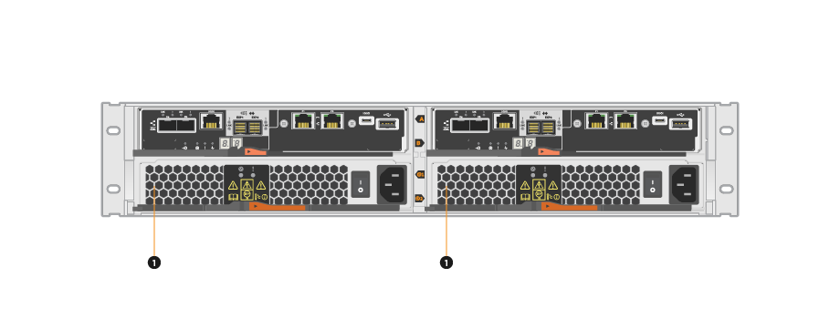
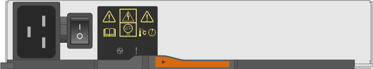
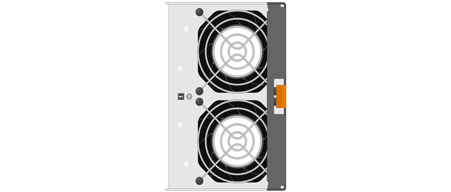

= Requirements for E5700 canister replacement
:icons: font
:imagesdir: ../media/

[.lead]
Before you replace an E5700 canister, review the requirements and considerations.

Canisters consist of three different types: power-fan canisters (power supplies) that supply a redundant power source and adequate cooling in a 12-drive or 24-drive controller shelf or drive shelf; power canisters that are used for power redundancy in a 60-drive controller shelf or drive shelf; and fan canisters that are used for cooling the 60-drive controller shelf or drive shelf.

== Power supply

Each 24-drive controller shelf or drive shelf includes two power supplies with integrated fans. These are referred to as _power-fan canisters_ in SANtricity System Manager. If a power-fan canister fails, you must replace it as soon as possible to ensure that the shelf has a redundant power source and adequate cooling.

=== Shelf types for a power supply

You can replace a power supply in the following shelves:

* E5724 controller shelf
* DE224C drive shelf

The following figure shows an example E5724 controller shelf with two power supplies (power-fan canisters). The DE224C drive shelves are identical, but they include I/O modules (IOMs) instead of controller canisters.

*(1)* _Controller shelf with two power supplies (power-fan canisters) below the controller canisters._

The __Replace power supply__ topics do not describe how to replace a failed power-fan canister in a DE1600 or DE5600 drive tray, which might be connected to the E5700 or E2800 controller shelves. For instructions for those drive tray models, refer to link:https://library.netapp.com/ecm/ecm_download_file/ECMP1140874[Replacing a Power-Fan Canister in the DE1600 Drive Tray or the DE5600 Drive Tray].

=== Requirements for replacing a power supply

If you plan to replace a power supply, keep the following requirements in mind.

* You must have a replacement power supply (power-fan canister) that is supported for your controller shelf or drive shelf model.
* You must have an ESD wristband, or you have taken other antistatic precautions.
* You can replace a power supply (power-fan canister) while your storage array is powered on and performing host I/O operations, as long as the following conditions are true:
 ** The second power supply (power-fan canister) in the shelf has an Optimal status.
 ** The *OK to remove* field in the Details area of the Recovery Guru in SANtricity System Manager displays *Yes*, indicating that it is safe to remove this component.
+
NOTE: If the second power supply (power-fan canister) in the shelf does not have Optimal status or if the Recovery Guru indicates that it is not OK to remove the power-fan canister, contact technical support.

== Power canister

Each 60-drive controller shelf or drive shelf includes two power canisters for power redundancy.

=== Shelf types for a power canister

You can replace a power canister in the following shelves:

* E5760 controller shelves
* DE460C drive shelf

The _Replace power canister_ topics do not describe how to replace a failed power canister in a DE6600 drive tray, which might be connected to the controller shelf.

The following figure shows the back of a DE460C drive shelf with the two power canisters:

image::../media/28_dwg_de460c_rear_no_callouts_maint-e5700.gif[]

The following figure shows a power canister:

=== Requirements for replacing a power canister

If you plan to replace a power canister, keep the following requirements in mind.

* You have a replacement power canister that is supported for your controller shelf or drive shelf model.
* You have one power canister that is installed and running.
* You have an ESD wristband, or you have taken other antistatic precautions.
* You can replace a power canister while your storage array is powered on and performing host I/O operations, as long as the following conditions are true:
* The other power canister in the shelf has Optimal status.
+
NOTE: While you perform the procedure, the other power canister supplies power to both fans to ensure that the equipment does not overheat.

* The *OK to remove* field in the Details area of the Recovery Guru in SANtricity System Manager displays *Yes*, indicating that it is safe to remove this component.
+
NOTE: If the second power canister in the shelf does not have Optimal status or if the Recovery Guru indicates that it is not OK to remove the power canister, contact technical support.

== Fan canister

Each 60-drive controller shelf or drive shelf includes two fan canisters.

=== Shelf types for a fan canister

You can replace a fan canister in the following shelves:

* E5760 controller shelves
* DE460C drive shelf

The _Replace fan canister_ topics do not describe how to replace a failed fan canister in a DE6600 drive tray, which might be connected to the controller shelf.

The following figure shows a fan canister:

The following figure shows the back of a DE460C shelf with two fan canisters:

image::../media/28_dwg_de460c_rear_no_callouts_maint-e5700.gif[]

CAUTION: *Possible equipment damage* -- If you replace a fan canister with the power turned on, you must complete the replacement procedure within 30 minutes to prevent the possibility of overheating the equipment.

=== Requirements for replacing a fan canister

If you plan to replace a fan canister, keep the following requirements in mind.

* You have a replacement fan canister (fan) that is supported for your controller shelf or drive shelf model.
* You have one fan canister that is installed and running.
* You have an ESD wristband, or you have taken other antistatic precautions.
* If you perform this procedure with the power turned on, you must complete it within 30 minutes to prevent the possibility of overheating the equipment.
* You can replace a fan canister while your storage array is powered on and performing host I/O operations, as long as the following conditions are true:
 ** The second fan canister in the shelf has an Optimal status.
 ** The *OK to remove* field in the Details area of the Recovery Guru in SANtricity System Manager displays *Yes*, indicating that it is safe to remove this component.
+
NOTE: If the second fan canister in the shelf does not have Optimal status or if the Recovery Guru indicates that it is not OK to remove the fan canister, contact technical support.
