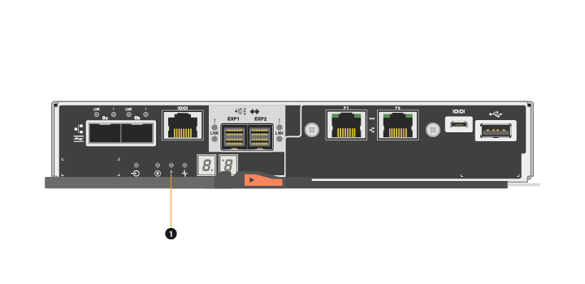

= Overview and requirements
:icons: font
:imagesdir: ../media/

[.lead]
This topic provides an overview of the controller and describes the requirements you need to know about before replacing a controller or adding a second controller.

== Controller overview

[.lead]
Each controller canister contains a controller card, a battery, and an optional host interface card (HIC).

=== Replace controller

When you replace a failed controller canister, you must remove the battery and HIC, if one is installed, from the original controller canister, and install them in the replacement controller canister.

You can determine if you have a failed controller canister in two ways:

* The Recovery Guru in SANtricity System Manager directs you to replace the controller canister.
* The amber Attention LED on the controller canister is on, indicating that the controller has a fault.

image:../media/legend_icon_01_maint-e5700.gif[]Attention LED

NOTE: The figure shows an example controller canister; the host ports on your controller canister might be different.

== Requirements for replacing a controller

[.lead]
If you plan to replace a controller or add a second controller, keep the following requirements in mind.

=== Requirements for replacing a failed controller

* You must have a replacement controller canister with the same part number as the controller canister you are replacing.
* You have an ESD wristband, or you have taken other antistatic precautions.
* You must use labels to identify each cable that is connected to the controller canister.
* You must have a #1 Phillips screwdriver.
* You must have installed SANtricity Storage Manager on a management station, so you can use the storage array's command line interface (CLI).
+
If this software has not yet been installed, follow the instructions in the link:../com.netapp.doc.ssm-exp-ic-lin/home.html[Linux express configuration], link:../com.netapp.doc.ssm-exp-ic-win/home.html[Windows express configuration], or link:../com.netapp.doc.ssm-exp-ic-vm/home.html[VMware express configuration] to download and install it.

*Duplex configuration*

For a controller shelf with two controllers (duplex configuration), you can replace a controller canister while your storage array is powered on and performing host I/O operations, as long as the following conditions are true:

* The second controller canister in the shelf has Optimal status.
* The *OK to remove* field in the Details area of the Recovery Guru in SANtricity System Manager displays *Yes*, indicating that it is safe to remove this component.
