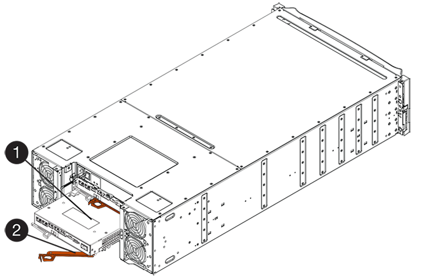
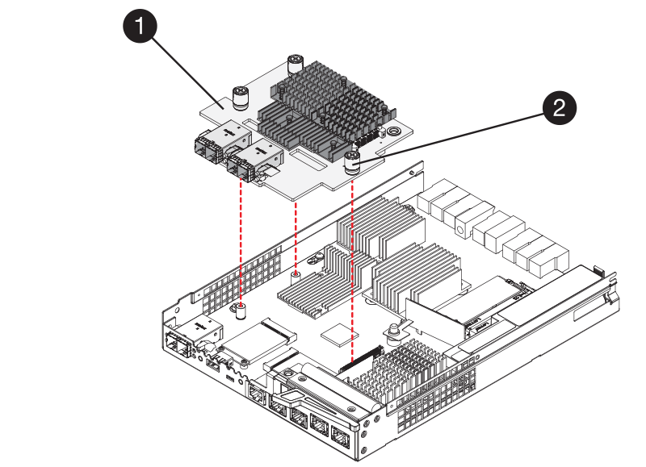
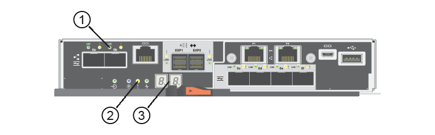

= Replace E5700 host interface card (HIC)
:experimental:
:icons: font
:imagesdir: ../media/

[.lead]
You can replace a host interface card (HIC) that has failed.

.About this task
When you replace a HIC, you place the controller offline (for duplex configurations), remove the controller canister, install the new HIC, and then replace the controller canister.

.Before you begin

* Review link:hics-overview-supertask-concept.html[Requirements for E5700 HIC replacement].
* Schedule a downtime maintenance window for this procedure. The power must be off when you install HICs, so you cannot access data on the storage array until you have successfully completed this procedure. (In a duplex configuration, both controllers must have the same HIC configuration when they are powered on.)
* Verify that no volumes are in use or that you have a multipath driver installed on all hosts using these volumes.
* From SANtricity System Manager, verify the details in the Recovery Guru to confirm that you have a failed HIC and to ensure no other items must be addressed before you can remove and replace the HIC.

.What you'll need

* Two HICs that are compatible with your controllers.
+
For duplex configurations (two controllers), the HICs installed in the two controller canisters must be identical. The presence of mismatched HICs causes the controller with the replacement HIC to lock down when you bring it online.
* An ESD wristband, or you have taken other antistatic precautions.
* A #1 Phillips screwdriver.
* Labels to identify each cable that is connected to the controller canister.
* A management station with a browser that can access SANtricity System Manager for the controller. (To open the System Manager interface, point the browser to the controller's domain name or IP address.)

== Step 1: Place controller offline (duplex)

If you have a duplex configuration, you must place the affected controller offline so you can safely remove the failed HIC.

.Steps

. From the Details area of the Recovery Guru, determine which of the controller canisters has the failed HIC.
. Back up the storage array's configuration database using SANtricity System Manager.
+
If a problem occurs during this procedure, you can use the saved file to restore your configuration. The system will save the current state of the RAID configuration database, which includes all data for volume groups and disk pools on the controller.
+
* From System Manager:
.. Select menu:Support[Support Center > Diagnostics].
.. Select *Collect Configuration Data*.
.. Click *Collect*.
+
The file is saved in the Downloads folder for your browser with the name, *configurationData-<arrayName>-<dateTime>.7z*.

* Alternatively, you can back up the configuration database by using the following CLI command:
+
`save storageArray dbmDatabase sourceLocation=onboard contentType=all file="filename";`

+
. Collect support data for your storage array using SANtricity System Manager.
+
If a problem occurs during this procedure, you can use the saved file to troubleshoot the issue. The system will save inventory, status, and performance data about your storage array in a single file.

.. Select menu:Support[Support Center > Diagnostics].
.. Select *Collect Support Data*.
.. Click *Collect*.
+
The file is saved in the Downloads folder for your browser with the name, *support-data.7z*.

. If the controller is not already offline, take it offline now using SANtricity System Manager.

 * From SANtricity System Manager:
  .. Select *Hardware*.
  .. If the graphic shows the drives, select *Show back of shelf* to show the controllers.
  .. Select the controller that you want to place offline.
  .. From the context menu, select *Place offline*, and confirm that you want to perform the operation.
+
NOTE: If you are accessing SANtricity System Manager using the controller you are attempting to take offline, a SANtricity System Manager Unavailable message is displayed. Select *Connect to an alternate network connection* to automatically access SANtricity System Manager using the other controller.

 * Alternatively, you can take the controllers offline by using the following CLI commands:
+
*For controller A:* `set controller [a] availability=offline`
+
*For controller B:* `set controller [b] availability=offline`
+
. Wait for SANtricity System Manager to update the controller's status to offline.
+
NOTE: Do not begin any other operations until after the status has been updated.

== Step 2: Remove controller canister

Remove the controller canister so you can add the new HIC.

.Steps

. Label each cable that is attached to the controller canister.
. Disconnect all the cables from the controller canister.
+
CAUTION: To prevent degraded performance, do not twist, fold, pinch, or step on the cables.

. Confirm that the Cache Active LED on the back of the controller is off.
+
The green Cache Active LED on the back of the controller is on when cached data needs to be written to the drives. You must wait for this LED to turn off before removing the controller canister.
+
image::../media/e5700_ib_hic_w_cache_led_callouts_maint-e5700.gif[]
+
*(1)* _Cache Active LED_

. Squeeze the latch on the cam handle until it releases, and then open the cam handle to the right to release the controller canister from the shelf.
+
The following figure is an example of an E5724 controller shelf:
+
image::../media/28_dwg_e2824_remove_controller_canister_maint-e5700.gif[]
+
*(1)* _Controller canister_
+
*(2)* _Cam handle_
+
The following figure is an example of an E5760 controller shelf:
+

+
*(1)* _Controller canister_
+
*(2)* _Cam handle_

. Using two hands and the cam handle, slide the controller canister out of the shelf.
+
CAUTION: Always use two hands to support the weight of a controller canister.
+
If you are removing the controller canister from an E5724 controller shelf, a flap swings into place to block the empty bay, helping to maintain air flow and cooling.

. Turn the controller canister over, so that the removable cover faces up.
. Place the controller canister on a flat, static-free surface.

== Step 3: Install a HIC

Install a new HIC to replace the failed one.

CAUTION: *Possible loss of data access* -- Never install a HIC in an E5700 controller canister if that HIC was designed for another E-Series controller. In addition, if you have a duplex configuration, both controllers and both HICs must be identical. The presence of incompatible or mismatched HICs causes the controllers to lock down when you apply power.

.Steps

. Unpack the new HIC and the new HIC faceplate.
. Press the button on the cover of the controller canister, and slide the cover off.
. Confirm that the green LED inside the controller (by the DIMMs) is off.
+
If this green LED is on, the controller is still using battery power. You must wait for this LED to go off before removing any components.
+
image::../media/28_dwg_e2800_internal_cache_active_led_maint-e5700.gif[]
+
*(1)* _Internal Cache Active LED_
+
*(2)* _Battery_

. Using a #1 Phillips screwdriver, remove the four screws that attach the blank faceplate to the controller canister, and remove the faceplate.
. Align the three thumbscrews on the HIC with the corresponding holes on the controller, and align the connector on the bottom of the HIC with the HIC interface connector on the controller card.
+
Be careful not to scratch or bump the components on the bottom of the HIC or on the top of the controller card.

. Carefully lower the HIC into place, and seat the HIC connector by pressing gently on the HIC.
+
CAUTION: *Possible equipment damage* -- Be very careful not to pinch the gold ribbon connector for the controller LEDs between the HIC and the thumbscrews.
+

+
*(1)* _Host interface card_
+
*(2)* _Thumbscrews_

. Hand-tighten the HIC thumbscrews.
+
Do not use a screwdriver, or you might over-tighten the screws.

. Using a #1 Phillips screwdriver, attach the new HIC faceplate to the controller canister with the four screws you removed previously.
+
image::../media/28_dwg_e2800_hic_faceplace_screws_maint-e5700.gif[]

== Step 4: Reinstall controller canister

After installing the HIC, reinstall the controller canister into the controller shelf.

.Steps

. Turn the controller canister over, so that the removable cover faces down.
. With the cam handle in the open position, slide the controller canister all the way into the controller shelf.
+
The following figure is an example of an E5724 controller shelf:
+
image::../media/28_dwg_e2824_remove_controller_canister_maint-e5700.gif[]
+
*(1)* _Controller canister_
+
*(2)* _Cam handle_
+
The following figure is an example of an E5760 controller shelf:
+

+
*(1)* _Controller canister_
+
*(2)* _Cam handle_

. Move the cam handle to the left to lock the controller canister in place.
. Reconnect all the cables you removed.
+
NOTE: Do not connect data cables to the new HIC ports at this time.

. (Optional) If you are adding HICs to a duplex configuration, repeat all steps to remove the second controller canister, install the second HIC, and reinstall the second controller canister.

== Step 5: Place controller online (duplex)

If you have a duplex configuration, bring the controller online to confirm the storage array is working correctly, collect support data, and resume operations.

NOTE: Perform this task only if your storage array has two controllers.

.Steps

. As the controller boots, check the controller LEDs and the seven-segment display.
+
NOTE: The figure shows an example controller canister. Your controller might have a different number and a different type of host ports.
+
When communication with the other controller is reestablished:

 ** The seven-segment display shows the repeating sequence *OS*, *OL*, *_blank_* to indicate that the controller is offline.
 ** The amber Attention LED remains lit.
 ** The Host Link LEDs might be on, blinking, or off, depending on the host interface.

+
*(1)* _Host Link LED_
+
*(2)* _Attention LED (amber)_
+
*(3)* _Seven-segment display_

. Bring the controller online using SANtricity System Manager.
 * From SANtricity System Manager:
  .. Select *Hardware*.
  .. If the graphic shows the drives, select *Show back of shelf*.
  .. Select the controller you want to place online.
  .. Select *Place Online* from the context menu, and confirm that you want to perform the operation.
+
The system places the controller online.

* Alternatively, you can use the following CLI commands:
+
*For controller A:* `set controller [a] availability=online;`
+
*For controller B:* `set controller [b] availability=online;`

. Check the codes on the controller's seven-segment display as it comes back online. If the display shows one of the following repeating sequences, immediately remove the controller.
 ** *OE*, *L0*, *_blank_* (mismatched controllers)
 ** *OE*, *L6*, *_blank_* (unsupported HIC)
*Attention:* *Possible loss of data access* -- If the controller you just installed shows one of these codes, and the other controller is reset for any reason, the second controller could also lock down.
. When the controller is back online, confirm that its status is Optimal, and check the controller shelf's Attention LEDs.
+
If the status is not Optimal or if any of the Attention LEDs are on, confirm that all cables are correctly seated, and check that the HIC and the controller canister are installed correctly. If necessary, remove and reinstall the controller canister and the HIC.
+
NOTE: If you cannot resolve the problem, contact technical support.

. Collect support data for your storage array using SANtricity System Manager.
 .. Select menu:Support[Support Center > Diagnostics].
 .. Select *Collect Support Data*.
 .. Click *Collect*.
+
The file is saved in the Downloads folder for your browser with the name, *support-data.7z*.
. Return the failed part to NetApp, as described in the RMA instructions shipped with the kit. See the https://mysupport.netapp.com/site/info/rma[Part Return & Replacements page] for further information.

.What's next?

Your HIC replacement is complete. You can resume normal operations.
