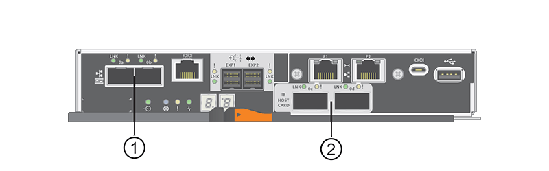

= Requirements for changing the E5700 host port protocol
:icons: font
:imagesdir: ../media/

[.lead]
Before converting the host port protocol in the E5700, review the requirements.

The following figure shows the E5700 with its SFP+ (optical) baseboard host ports *(1)* and the optional two IB HIC ports *(2)*.

== Requirements

* You must schedule a downtime maintenance window for this procedure.
* You must stop host I/O operations when you perform the conversion, and you will not be able to access data on the storage array until you have successfully completed the conversion.
* You must use out-of-band management. (You cannot use in-band management to complete this procedure.)
* You have obtained the necessary hardware for the conversion. Your NetApp Sales Representative can help you determine what hardware you need and help you order the correct parts.
* If you are attempting to change the baseboard host ports of your storage array, and it currently uses dual-protocol (also referred to as _unified_) SFP transceivers that you purchased from NetApp, you do not need to change your SFP transceivers.
* Make sure that the dual-protocol SFP transceivers support both FC (at 4 Gbps, or 16 Gbps) and iSCSI (at 10 Gbps), but they do not support 1 Gbps iSCSI. See link:hpp-change-host-protocol-task.html[Step 1: Determine whether you have dual-protocol SFPs] to determine what type of SFP transceivers are installed.

== Considerations for changing the host protocol

The considerations for changing the host protocol depend on the starting and ending protocols of the baseboard host ports and the HIC ports.

If you use a Mirroring feature or the Data Assurance (DA) feature, you must understand what happens to these features when you change the host port protocol.

NOTE: The following considerations apply only if you are converting a storage array that has already been in use. These considerations do not apply if you are converting a new storage array that does not yet have hosts and volumes defined.

=== Converting from FC to iSCSI

* Asynchronous Mirroring requires both the local storage array and the remote storage array to use the same protocol.
 ** If you are currently using Asynchronous Mirroring through the baseboard, you must deactivate Asynchronous Mirroring relationships using those ports before applying the feature pack.
 ** Refer to the online help for SANtricity System Manager to delete all mirror consistency groups and remove all mirrored pairs from the local and remote storage arrays. In addition, follow the instructions in the online help to deactivate Asynchronous Mirroring.
+
NOTE: If your configuration contains SAN Boot hosts connected to the FC baseboard ports, check the https://mysupport.netapp.com/NOW/products/interoperability[NetApp Interoperability Matrix^] tool to ensure that the configuration is supported on iSCSI. If it is not, you cannot convert the host protocol to iSCSI.

* The Synchronous Mirroring feature is not supported for iSCSI.
 ** If you are currently using Synchronous Mirroring relationships via the baseboard ports, you must deactivate those Synchronous Mirroring relationships.
 ** Refer to the online help for SANtricity System Manager to remove all synchronous mirrored pairs, which removes mirror relationships on the local storage array and on the remote storage array. In addition, follow the instructions in the online help to deactivate Synchronous Mirroring.
+
CAUTION: If you do not deactivate Synchronous Mirroring relationships before converting to iSCSI, your system will lose data access and data loss might occur.

=== Converting from iSCSI to FC

* Asynchronous Mirroring requires both the local storage array and the remote storage array to use the same protocol. If you are currently using Asynchronous Mirroring with the baseboard ports, you must deactivate Asynchronous Mirroring before changing the protocol.
* Refer to the online help for SANtricity System Manager to delete all mirror consistency groups and remove all mirrored pairs from the local and remote storage arrays. In addition, follow the instructions in the online help to deactivate Asynchronous Mirroring.

=== Converting IB-iSER to/from IB-SRP

* You do not have to make any changes to your hardware when you convert from/to iSER to SRP.
* The Data Assurance (DA) feature is not supported for SRP.
* The DA feature is not supported for IB-SRP. If you are currently using this feature via the IB-HIC and you want to convert those ports from iSER to SRP, you must permanently disable DA on all volumes. Refer to the online help for SANtricity System Manager to change the settings for a volume to permanently disable the data assurance setting.
+
NOTE: After it has been disabled, DA cannot be re-enabled on the volume.

* Confirm the following:
 ** SANtricity System Manager is accessible via a web browser.
 ** The storage system is running SANtricity OS (controller firmware) version 08.40.11.00 or later.

=== Mirroring operations need same host protocol

Mirroring operations are not affected if the host ports being used for mirroring keep the same protocol after you apply the feature pack. Even so, before applying the feature pack, you should confirm that all mirror consistency groups are synchronized. After applying the feature pack, you should test the communication between the local storage array and the remote storage array. Refer to the online help for SANtricity System Manager if you have questions on how to do this.

NOTE: Asynchronous and synchronous mirroring are not supported for NVMe over Fabrics. To disable Asynchronous and Synchronous mirroring, you can use the `disable storageArray feature=asyncMirror` or `disable storageArray feature=syncMirror` commands through the command line interface. Refer to the http://docs.netapp.com/ess-11/topic/com.netapp.doc.ssm-cli-115/GUID-0F156C94-C2A7-4458-A922-56439A098C09.html[Disable storage array feature^] mirroring commands under the CLI Command Reference Online Help for more information on how to disable mirroring.
