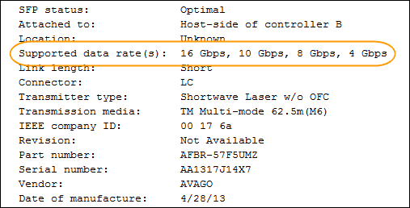
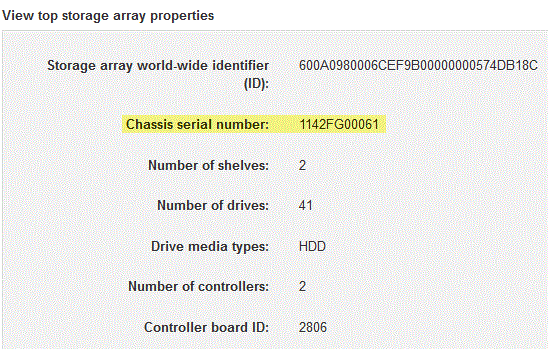
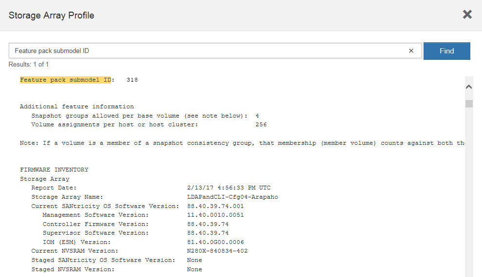
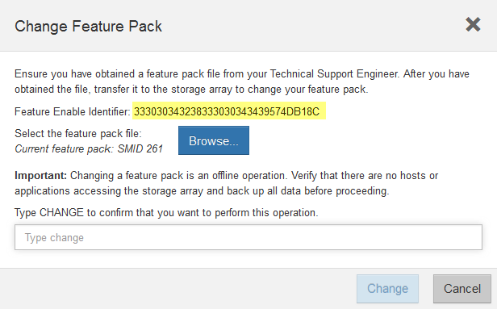
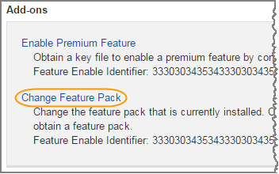

= Change host protocol
:icons: font
:imagesdir: ../media/

[.lead]
You can convert the host port protocol of the baseboard host ports from Fibre Channel (FC) to iSCSI or from iSCSI to FC. If you have an Infiniband (IB) HIC, you can also convert the protocol of the IB HIC from iSER to InfiniBand, SRP to InfiniBand, NVMe to InfiniBand, or from NVMe to RoCE.

== Step 1: Determine whether you have dual-protocol SFPs

[.lead]
Use SANtricity System Manager to determine what type of SFP transceivers you have. Because these SFPs can be used with both FC and iSCSI protocols, they are referred to as _dual-protocol_ or _unified_ SFPs.

If your current SFPs support data rates of 16 Gbps and 10 Gbps, you can continue to use them after converting the host port protocol.

. From SANtricity System Manager, select *Support*.
. Select the *Support Center* tile.
. On theSupport Resources tab, locate and select the *Storage Array Profile* link.
. Type *SFP* in the text box, and click *Find*.
. For each SFP listed in the Storage Array Profile, locate the entry for *Supported data rate(s)*.
+

. Refer to the table to determine whether you can reuse the SFPs, as follows:
+
[options="header"]
|===
| Supported data rate(s)| SFP type| Supported protocol
a|
16 Gbps, 10 Gbps, 4 Gbps
a|
Dual-protocol
a|

 ** *FC:* 16 Gbps, 4 Gbps
 ** **iSCSI:**10 Gbps

a|
10 Gbps
a|
10 Gbps
a|
iSCSI only
a|
16 Gbps, 8 Gbps, 4 Gbps
a|
16 Gbps
a|
FC only
|===

 ** If you have dual-protocol SFPs, you can continue using them after you convert the protocol.
+
NOTE: The dual-protocol SFPs do not support 1 Gb iSCSI. If you are converting host ports to iSCSI, be aware that the dual-protocol SFPs support only a 10 Gb link to the connected port.

 ** If you have 16 Gbps SFPs, and you are converting host ports to iSCSI, you must remove the SFPs and replace them with dual-protocol or 10 Gbps SFPs after converting the protocol. As needed, you can also use 10 Gbps iSCSI copper by using a special Twin-Ax cable with SFPs.
+
NOTE: 8Gbps FC SFPs are NOT supported in the E28xx or E57xx controllers. ONLY 16Gbps and 32 Gbps FC SFPs are supported.

 ** If you have 10 Gbps SFPs, and you are converting host ports to FC, you must remove the SFPs from these ports and replace them with dual-protocol or 16 Gbps SFPs after converting the protocol.

== Step 2: Obtain the feature pack

[.lead]
To obtain the feature pack, you need the serial number from the controller shelf, a Feature Activation Code, and the Feature Enable Identifier for the storage array.

. Locate the serial number.
 .. From SANtricity System Manager, select *Support* > *Support Center*.
 .. With the *Support Resources* tab selected, scroll to the *View top storage array properties* section.
 .. Locate the *Chassis Serial Number*, and copy this value to a text file.
+

. Locate the *feature pack submodel ID*.
 .. From the SANtricity System Manager, select *Support*.
 .. Select the *Support Center* tile.
 .. On the Support Resources tab, locate and select the *Storage Array Profile* link.
 .. Type *feature pack submodel ID* in the text box, and click *Find*.
 .. Locate the feature pack submodel ID for the starting configuration.
+

. Using the feature pack submodel ID, locate the corresponding Controller submodel ID for the starting configuration and find the Feature Activation Code for the desired ending configuration within the table below. Then, copy that Feature Activation Code to a text file.
+
NOTE: Baseboard ports are disabled when running an NVMe protocol on the HIC.
+
NOTE: If you are not using the IB HIC, you can ignore the _HIC Ports_ column in the following tables:
+
[options="header"]
|===
2+| Starting Configuration 2+| Ending Configuration .2+| Feature Activation Code
| Controller submodel ID| Ports to Convert| Controller Submodel ID| Ports Converted To
a|
360
a|
FC baseboard ports
a|
362
a|
iSCSI baseboard ports
a|
SGL-2SB-ZEX13
a|
362
a|
iSCSI baseboard ports
a|
360
a|
FC baseboard ports
a|
5GI-4TB-ZW3HL
|===
[options="header"]
|===
3+| Starting configuration 3+| Ending configuration .2+| Feature Activation Code
| Controller Submodel ID| Baseboard Ports| HIC Ports| Controller Submodel ID| Baseboard Ports| HIC Ports
.5+a|
360
.5+a|
FC
.5+a|
iSER
a|
361
a|
FC
a|
SRP
a|
UGG-XSB-ZCZKU
a|
362
a|
iSCSI
a|
iSER
a|
SGL-2SB-ZEX13
a|
363
a|
iSCSI
a|
SRP
a|
VGN-LTB-ZGFCT
a|
382
a|
Not Available
a|
NVMe/IB
a|
KGI-ISB-ZDHQF
a|
403
a|
Not Available
a|
NVMe/RoCE or NVMe/FC
a|
YGH-BHK-Z8EKB
.5+a|
361
.5+a|
FC
.5+a|
SRP
a|
360
a|
FC
a|
iSER
a|
JGS-0TB-ZID1V
a|
362
a|
iSCSI
a|
iSER
a|
UGX-RTB-ZLBPV
a|
363
a|
iSCSI
a|
SRP
a|
2G1-BTB-ZMRYN
a|
382
a|
Not Available
a|
NVMe/IB
a|
TGV-8TB-ZKTH6
a|
403
a|
Not Available
a|
NVMe/RoCE or NVMe/FC
a|
JGM-EIK-ZAC6Q
.5+a|
362
.5+a|
iSCSI
.5+a|
iSER
a|
360
a|
FC
a|
iSER
a|
5GI-4TB-ZW3HL
a|
361
a|
FC
a|
SRP
a|
EGL-NTB-ZXKQ4
a|
363
a|
iSCSI
a|
SRP
a|
HGP-QUB-Z1ICJ
a|
383
a|
Not Available
a|
NVMe/IB
a|
BGS-AUB-Z2YNG
a|
403
a|
Not Available
a|
NVMe/RoCE or NVMe/FC
a|
1GW-LIK-ZG9HN
.5+a|
363
.5+a|
iSCSI
.5+a|
SRP
a|
360
a|
FC
a|
iSER
a|
SGU-TUB-Z3G2U
a|
361
a|
FC
a|
SRP
a|
FGX-DUB-Z5WF7
a|
362
a|
iSCSI
a|
SRP
a|
LG3-GUB-Z7V17
a|
383
a|
Not Available
a|
NVMe/IB
a|
NG5-ZUB-Z8C8J
a|
403
a|
Not Available
a|
NVMe/RoCE or NVMe/FC
a|
WG2-0IK-ZI75U
.5+a|
382
.5+a|
Not Available
.5+a|
NVMe/IB
a|
360
a|
FC
a|
iSER
a|
QG6-ETB-ZPPPT
a|
361
a|
FC
a|
SRP
a|
XG8-XTB-ZQ7XS
a|
362
a|
iSCSI
a|
iSER
a|
SGB-HTB-ZS0AH
a|
363
a|
iSCSI
a|
SRP
a|
TGD-1TB-ZT5TL
a|
403
a|
Not Available
a|
NVMe/RoCE or NVMe/FC
a|
IGR-IIK-ZDBRB
.5+a|
383
.5+a|
Not Available
.5+a|
NVMe/IB
a|
360
a|
FC
a|
iSER
a|
LG8-JUB-ZATLD
a|
361
a|
FC
a|
SRP
a|
LGA-3UB-ZBAX1
a|
362
a|
iSCSI
a|
iSER
a|
NGF-7UB-ZE8KX
a|
363
a|
iSCSI
a|
SRP
a|
3GI-QUB-ZFP1Y
a|
403
a|
Not Available
a|
NVMe/RoCE or NVMe/FC
a|
5G7-RIK-ZL5PE
.5+a|
403
.5+a|
Not Available
.5+a|
NVMe/RoCE or NVMe/FC
a|
360
a|
FC
a|
iSER
a|
BGC-UIK-Z03GR
a|
361
a|
FC
a|
SRP
a|
LGF-EIK-ZPJRX
a|
362
a|
iSCSI
a|
iSER
a|
PGJ-HIK-ZSIDZ
a|
363
a|
iSCSI
a|
SRP
a|
1GM-1JK-ZTYQX
a|
382
a|
Not Available
a|
NVMe/IB
a|
JGH-XIK-ZQ142
a|
383
a|
Not Available
a|
NVMe/IB
a|
PG0-KJK-ZUGW5
|===
[options="header"]
|===
2+| Starting configuration 2+| Ending Configuration .2+| Feature Activation Code
| Controller submodel ID| Ports to Convert| Controller Submodel ID| Ports Converted To
a|
365
a|
FC baseboard ports
a|
367
a|
iSCSI baseboard ports
a|
BGU-GVB-ZM3KW
a|
367
a|
iSCSI baseboard ports
a|
366
a|
FC baseboard ports
a|
9GU-2WB-Z503D
|===
[options="header"]
|===
3+| Starting configuration 3+| Ending configuration .2+| Feature Activation Code
| Controller submodel ID| Baseboard ports| HIC ports| Controller submodel ID| Baseboard ports| HIC ports
.5+a|
365
.5+a|
FC
.5+a|
iSER
a|
366
a|
FC
a|
SRP
a|
BGP-DVB-ZJ4YC
a|
367
a|
iSCSI
a|
iSER
a|
BGU-GVB-ZM3KW
a|
368
a|
iSCSI
a|
SRP
a|
4GX-ZVB-ZNJVD
a|
384
a|
Not Available
a|
NVMe/IB
a|
TGS-WVB-ZKL9T
a|
405
a|
Not Available
a|
NVMe/RoCE or NVMe/FC
a|
WGC-GJK-Z7PU2
.5+a|
366
.5+a|
FC
.5+a|
SRP
a|
365
a|
FC
a|
iSER
a|
WG2-3VB-ZQHLF
a|
367
a|
iSCSI
a|
iSER
a|
QG7-6VB-ZSF8M
a|
368
a|
iSCSI
a|
SRP
a|
PGA-PVB-ZUWMX
a|
384
a|
Not Available
a|
NVMe/IB
a|
CG5-MVB-ZRYW1
a|
405
a|
Not Available
a|
NVMe/RoCE or NVMe/FC
a|
3GH-JJK-ZANJQ
.5+a|
367
.5+a|
iSCSI
.5+a|
iSER
a|
365
a|
FC
a|
iSER
a|
PGR-IWB-Z48PC
a|
366
a|
FC
a|
SRP
a|
9GU-2WB-Z503D
a|
368
a|
iSCSI
a|
SRP
a|
SGJ-IWB-ZJFE4
a|
385
a|
Not Available
a|
NVMe/IB
a|
UGM-2XB-ZKV0B
a|
405
a|
Not Available
a|
NVMe/RoCE or NVMe/FC
a|
8GR-QKK-ZFJTP
.5+a|
368
.5+a|
iSCSI
.5+a|
SRP
a|
365
a|
FC
a|
iSER
a|
YG0-LXB-ZLD26
a|
366
a|
FC
a|
SRP
a|
SGR-5XB-ZNTFB
a|
367
a|
iSCSI
a|
SRP
a|
PGZ-5WB-Z8M0N
a|
385
a|
Not Available
a|
NVMe/IB
a|
KG2-0WB-Z9477
a|
405
a|
Not Available
a|
NVMe/RoCE or NVMe/FC
a|
2GV-TKK-ZIHI6
.5+a|
384
.5+a|
Not Available
.5+a|
NVMe/IB
a|
365
a|
FC
a|
iSER
a|
SGF-SVB-ZWU9M
a|
366
a|
FC
a|
SRP
a|
7GH-CVB-ZYBGV
a|
367
a|
iSCSI
a|
iSER
a|
6GK-VVB-ZZSRN
a|
368
a|
iSCSI
a|
SRP
a|
RGM-FWB-Z195H
a|
405
a|
Not Available
a|
NVMe/RoCE or NVMe/FC
a|
VGM-NKK-ZDLDK
.5+a|
385
.5+a|
Not Available
.5+a|
NVMe/IB
a|
365
a|
FC
a|
iSER
a|
GG5-8WB-ZBKEM
a|
366
a|
FC
a|
SRP
a|
KG7-RWB-ZC2RZ
a|
367
a|
iSCSI
a|
iSER
a|
NGC-VWB-ZFZEN
a|
368
a|
iSCSI
a|
SRP
a|
4GE-FWB-ZGGQJ
a|
405
a|
Not Available
a|
NVMe/RoCE or NVMe/FC
a|
NG1-WKK-ZLFAI
.5+a|
405
.5+a|
Not Available
.5+a|
NVMe/RoCE or NVMe/FC
a|
365
a|
FC
a|
iSER
a|
MG6-ZKK-ZNDVC
a|
366
a|
FC
a|
SRP
a|
WG9-JKK-ZPUAR
a|
367
a|
iSCSI
a|
iSER
a|
NGE-MKK-ZRSW9
a|
368
a|
iSCSI
a|
SRP
a|
TGG-6KK-ZT9BU
a|
384
a|
Not Available
a|
NVMe/IB
a|
AGB-3KK-ZQBLR
a|
385
a|
Not Available
a|
NVMe/IB
a|
JGJ-PKK-ZUQG2
|===
*Note:* If your controller submodel ID is not listed, contact http://mysupport.netapp.com[NetApp Support].

. In System Manager, locate the Feature Enable Identifier.
 .. Go to *Settings* > *System*.
 .. Scroll down to *Add-ons*.
 .. Under *Change Feature Pack*, locate the *Feature Enable Identifier*.
 .. Copy and paste this 32-digit number to a text file.
+

. Go to http://partnerspfk.netapp.com[NetApp License Activation: Storage Array Premium Feature Activation], and enter the information required to obtain the feature pack.
 ** Chassis serial number
 ** Feature Activation Code
 ** Feature Enable Identifier
*Important:* The Premium Feature Activation web site includes a link to "`Premium Feature Activation Instructions.`" Do not attempt to use those instructions for this procedure.
. Choose whether to receive the key file for the feature pack in an email or download it directly from the site.

== Step 3: Stop host I/O

[.lead]
You must stop all I/O operations from the host before converting the protocol of the host ports. You cannot access data on the storage array until you successfully complete the conversion.

This task applies only if you are converting a storage array that has already been in use.

. Ensure that no I/O operations are occurring between the storage array and all connected hosts. For example, you can perform these steps:
 ** Stop all processes that involve the LUNs mapped from the storage to the hosts.
 ** Ensure that no applications are writing data to any LUNs mapped from the storage to the hosts.
 ** Unmount all file systems associated with volumes on the array.
*Note:* The exact steps to stop host I/O operations depend on the host operating system and the configuration, which are beyond the scope of these instructions. If you are not sure how to stop host I/O operations in your environment, consider shutting down the host.

+
IMPORTANT: *Possible data loss* - If you continue this procedure while I/O operations are occurring, the host application might lose data because the storage array will not be accessible.
. If the storage array participates in a mirroring relationship, stop all host I/O operations on the secondary storage array.
. Wait for any data in cache memory to be written to the drives.
+
The green Cache Active LEDimage:../media/legend_icon_01_maint-e5700.gif[] on the back of each controller is on when cached data needs to be written to the drives. You must wait for this LED to turn off.image:../media/e5700_ib_hic_w_cache_led_callouts_maint-e5700.gif[]

. From the Home page of SANtricity System Manager, select *View Operations in Progress*.
. Wait for all operations to complete before continuing with the next step.

== Step 4: Change the feature pack

[.lead]
You change the feature pack to convert the host protocol of the baseboard host ports, the IB HIC ports, or both types of ports.

. From SANtricity System Manager, select *Settings* > *System*.
. Under *Add-ons*, select *Change Feature Pack*.
+

. Click *Browse*, and then select the feature pack you want to apply.
. Type *CHANGE* in the field.
. Click *Change*.
+
The feature pack migration begins. Both controllers automatically reboot twice to allow the new feature pack to take effect. The storage array returns to a responsive state after the reboot is complete.

. Confirm the host ports have the protocol you expect.
 .. From SANtricity System Manager, select *Hardware*.
 .. Click *Show back of shelf*.
 .. Select the graphic for either Controller A or Controller B.
 .. Select *View settings* from the context menu.
 .. Select the *Host Interfaces* tab.
 .. Click *Show more settings*.
 .. Review the details shown for the baseboard ports and the HIC ports (labeled "`slot 1`"), and confirm that each type of port has the protocol you expect.

Go to link:hpp_complete_protocol_conversion_task.md#[Complete host protocol conversion].
