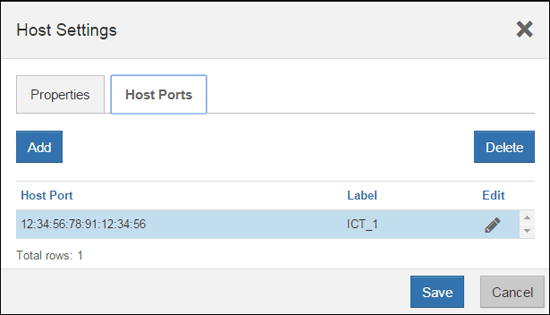

= Complete host protocol conversion
:icons: font
:imagesdir: ../media/

[.lead]
After converting the protocol of the host ports, you need to perform additional steps before you can use the new protocol. The steps you might need to complete depend on the starting and ending protocols of the baseboard host ports and the HIC ports.

== Complete FC to iSCSI conversion

[.lead]
If you previously had FC host ports and you converted to iSCSI, you might need to modify your existing configuration to support iSCSI. The following procedure is only applicable if there is no iSCSI HIC present.

===== Before You Begin

This task applies only if you are converting a storage array that has already been in use.

This task does not apply if you are converting a new storage array that does not yet have hosts and volumes defined. If you converted the host-port protocol of a new storage array, see _Cabling E-Series hardware_ to install cables and SFPs. Then, follow the instructions in the link:../com.netapp.doc.ssm-exp-ic-lin/home.html[Linux express configuration], link:../com.netapp.doc.ssm-exp-ic-win/home.html[Windows express configuration], or link:../com.netapp.doc.ssm-exp-ic-vm/home.html[VMware express configuration] to complete the setup for each protocol.

===== Steps

. Configure the switches.
+
You should configure the switches used to transport iSCSI traffic according to the vendor's recommendations for iSCSI. These recommendations might include both configuration directives as well as code updates.

. From SANtricity System Manager, select *Hardware* > *Configure iSCSI ports*.
. Select the port settings.
+
You can set up your iSCSI network in many ways. Consult your network administrator for tips on selecting the best configuration for your environment.

. Update the host definitions in SANtricity System Manager.
+
NOTE: If you need instructions to add hosts or host clusters, refer to the online help for SANtricity System Manager.

 .. Select *Storage* > *Hosts*.
 .. Select the host to which the port will be associated, and click *View/Edit Settings*.
+
The Host Settings dialog box appears.

 .. Click the *Host Ports* tab.
+

 .. Click *Add*, and use the *Add Host Port* dialog box to associate a new host port identifier to the host.
+
The length of the host port identifier name is determined by the host interface technology. FC host port identifier names must have 16 characters. iSCSI host port identifier names have a maximum of 223 characters. The port must be unique. A port number that has already been configured is not allowed.

 .. Click *Delete*, and use the *Delete Host Port* dialog box to remove (unassociate) a host port identifier.
+
The *Delete* option does not physically remove the host port. This option removes the association between the host port and the host. Unless you remove the host bus adapter or the iSCSI initiator, the host port is still recognized by the controller.

 .. Click**Save** to apply your changes to the host port identifier settings.
 .. Repeat these steps to add and remove any additional host port identifiers.

. Reboot the host or perform a rescan so that the host properly discovers the LUNs.
. Remount volumes or start using block volume.

Your host protocol conversion is complete. You can resume normal operations.

== Complete iSCSI to FC conversion

[.lead]
If you previously had iSCSI host ports and you converted to FC, you might need to modify your existing configuration to support FC. The following procedure is only applicable if no FC HIC is present.

===== Before You Begin

This task applies only if you are converting a storage array that has already been in use.

This task does not apply if you are converting a new storage array that does not yet have hosts and volumes defined. If you converted the host-port protocol of a new storage array, see _Cabling E-Series hardware_ to install cables and SFPs. Then, follow the instructions in the link:../com.netapp.doc.ssm-exp-ic-lin/home.html[Linux express configuration], link:../com.netapp.doc.ssm-exp-ic-win/home.html[Windows express configuration], or link:../com.netapp.doc.ssm-exp-ic-vm/home.html[VMware express configuration] to complete the setup for each protocol.

===== Steps

. Install the HBA utility and determine initiator WWPNs.
. Zone the switches.
+
Zoning the switches enables the hosts to connect to the storage and limits the number of paths. You zone the switches using the management interface of the switches.

. Update the host definitions in SANtricity System Manager.
 .. Select *Storage* > *Hosts*.
 .. Select the host to which the port will be associated, and click *View/Edit Settings*.
+
The Host Settings dialog box appears.

 .. Click the *Host Ports* tab.
+

 .. Click *Add*, and use the *Add Host Port* dialog box to associate a new host port identifier to the host.
+
The length of the host port identifier name is determined by the host interface technology. FC host port identifier names must have 16 characters. iSCSI host port identifier names have a maximum of 223 characters. The port must be unique. A port number that has already been configured is not allowed.

 .. Click *Delete*, and use the *Delete Host Port* dialog box to remove (unassociate) a host port identifier.
+
The *Delete* option does not physically remove the host port. This option removes the association between the host port and the host. Unless you remove the host bus adapter or the iSCSI initiator, the host port is still recognized by the controller.

 .. Click**Save** to apply your changes to the host port identifier settings.
 .. Repeat these steps to add and remove any additional host port identifiers.
. Reboot the host or perform a rescan so that the host properly discovers mapped storage.
. Remount volumes or start using block volume.

Your host protocol conversion is complete. You can resume normal operations.

== Complete IB-iSER to/from IB-SRP, NVMe over InfiniBand, NVMe over RoCE conversion, or NVMe over Fiber Channel

[.lead]
After you apply the feature pack key to convert the protocol used by your InfiniBand iSER HIC port to/from SRP, NVMe over InfiniBand, NVMe over RocE, or NVMe over Fiber Channel you need to configure the host to use the appropriate protocol.

===== Steps

. Configure the host to use the SRP, iSER, or NVMe protocol.
+
For step-by-step instructions on how to configure the host to use SRP, iSER, or NVMe, see the _Linux Express Configuration_.

. To connect the host to the storage array for an SRP configuration, you must enable the InfiniBand driver stack with the appropriate options.
+
Specific settings might vary between Linux distributions. Check the http://mysupport.netapp.com/matrix[NetApp Interoperability Matrix] for specific instructions and additional recommended settings for your solution.

Your host protocol conversion is complete. You can resume normal operations.
