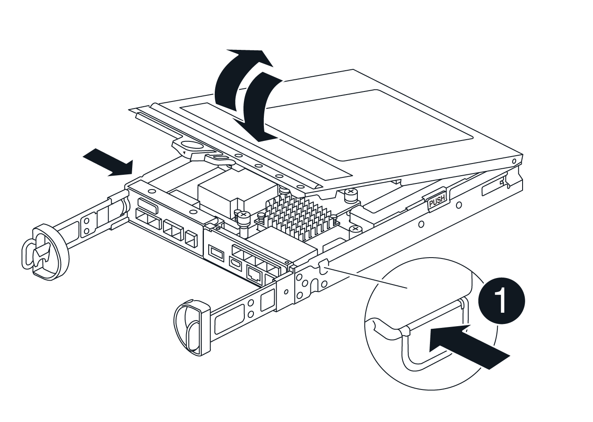
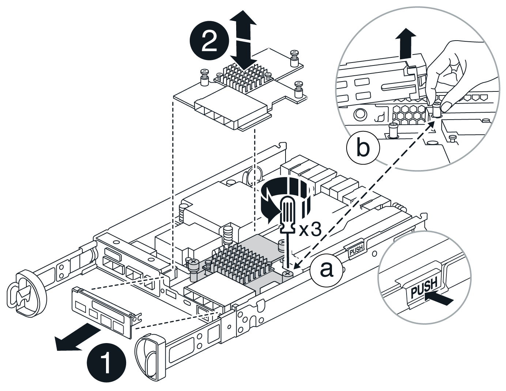

= Upgrade the host interface card (HIC) - EF50, EF50C, EF80, and EF80C
:icons: font
:imagesdir: ../media/

[.lead]
You can upgrade the host interface cards (HICs) or I/O modules to increase the number of host ports.

.About this task

* When you upgrade HICs, you must power off the storage system, upgrade the HICs, and then reapply power.
* You upgrade a HIC one controller at a time by using this procedure for the first controller an then repeating it for the second controller.

.Before you begin

* Schedule a downtime maintenance window for this procedure. You cannot access data on the storage system until you have successfully completed this procedure.

* Make sure that the HICs you are upgrading to are supported by your storage system and that you have the same type and number of HICs for each controller.
+
CAUTION: *Possible loss of data access* -- The presence of incompatible or mismatched HICs causes the controllers to lock down when you apply power.
+
If needed, you can confirm supported HICs for your storage system at https://hwu.netapp.com[NetApp Hardware Universe^].

* Make sure you have the following:
** An ESD wristband, or you have taken other antistatic precautions.
** A flat, static free work area.
** Labels to identify each cable that is connected to the controllers. BUT hey, not removing the controllers...or do you have to
** A management station with a browser that can access SANtricity System Manager for the controller. (To open the System Manager interface, point the browser to the controller's domain name or IP address.)

== Step 1: Place controller offline

Place one of the controllers offline so you can safely upgrade the HICs.

.Steps

. From the Home page of SANtricity System Manager, ensure that the storage system has Optimal status.
+
If the status is not Optimal, use the Recovery Guru or contact https://mysupport.netapp.com/site/global/dashboard[NetApp Support^] to resolve the problem. Do not continue with this procedure.

. Click *Support > Upgrade Center* to ensure that the latest version of SANtricity OS is installed.
+
As needed, install the latest version.

. Back up the storage system's configuration database using SANtricity System Manager.
+
If a problem occurs when you remove a controller, you can use the saved file to restore your configuration. The system saves the current state of the RAID configuration database, which includes all data for volume groups and disk pools on the controller.
+
* From System Manager:
.. Select *Support > Support Center > Diagnostics*.
.. Select *Collect Configuration Data*.
.. Click *Collect*.
+
The file is saved in the Downloads folder for your browser with the name, *configurationData-<arrayName>-<dateTime>.7z*.

. Ensure that no I/O operations are occurring between the storage system and all connected hosts. For example, you can perform these steps:
** Stop all processes that involve the LUNs mapped from the storage system to the hosts.
** Ensure that no applications are writing data to any LUNs mapped from the storage system to the hosts.
** Unmount all file systems associated with volumes on the storage system.
+
NOTE: The exact steps to stop host I/O operations depend on the host operating system and the configuration, which are beyond the scope of these instructions. If you are not sure how to stop host I/O operations in your environment, consider shutting down the host.
+
CAUTION: *Possible data loss* -- If you continue this procedure while I/O operations are occurring, the host application might lose access to the data because the storage is not accessible.

. Wait for any data in cache memory to be written to the drives.
+
The green Cache Active LED on the back of each controller is on when cached data needs to be written to the drives. You must wait for this LED to turn off.

. From the Home page of SANtricity System Manager, select *View Operations in Progress*. Wait for all operations to complete before continuing with the next step.
. Power down the controller:
.. Label and then unplug both power cables from the controller.
.. Wait for all LEDs on the controller to turn off.

//[[step2_remove_controller_canister]]
== Step 2: Remove controller

Remove the controller from the chassis Is this needed since these are I/Os with thumbscrews? Look at G-O.

.Steps

. If you are not already grounded, properly ground yourself.
. Loosen the hook and loop strap binding the cables to the cable management device, and then unplug the system cables and SFPs (if needed) from the controller, keeping track of where the cables were connected.
+
Leave the cables in the cable management device so that when you reinstall the cable management device, the cables are organized.
. Remove and set aside the cable management devices from the left and right sides of the controller.
. Squeeze the latch on the cam handle until it releases, open the cam handle fully to release the controller from the midplane, and then, using two hands, pull the controller out of the chassis.
. Turn the controller over and place it on a flat, stable surface.
. Open the cover by pressing the blue buttons on the sides of the controller to release the cover, and then rotate the cover up and off of the controller.
+

//[[step3_upgrade_hic]]
== Step 3: Upgrade the HIC

Remove and replace the HIC. There is no removing needed for gE.

.Steps
. If you are not already grounded, properly ground yourself.
. Remove the HIC:
+

.. Remove the HIC faceplate by loosening all screws and sliding it straight out from the controller module.
.. Loosen the thumbscrews on the HIC and lift the HIC straight up.
. Reinstall the HIC:
.. Align the socket on the replacement HIC plug with the socket on the motherboard, and then gently seat the card squarely into the socket.
.. Tighten the three thumbscrews on the HIC.
.. Reinstall the HIC faceplate.
. Reinstall the controller module cover and lock it into place.

//[[step4_reinstall_controller]]
== Step 4: Reinstall controller

Reinstall the controller into the chassis.

.Steps

. If you are not already grounded, properly ground yourself.
. If you have not already done so, replace the cover on the controller.
. Turn the controller over, so that the removable cover faces down.
. With the cam handle in the open position, slide the controller all the way into the chassis.
. Replace the cables.
+
NOTE: If you removed the media converters (QSFPs or SFPs), remember to reinstall them if you are using fiber optic cables.
. Bind the cables to the cable management device with the hook and loop strap.

== Step 5: Complete the HIC upgrade

Repeat the procedure for the other controller and then place both controllers online, collect support data, and resume operations.

.Steps

. Repeat procedure Step 1 through Step 4 for the second controller.
Place both controllers online.
.. Plug in power cables.
. As the controllers boot, check the controller LEDs.
** The amber Attention LED remains on.
** The Host Link LEDs might be on, blinking, or off, depending on the host interface.
. When the controllers are back online, confirm that their status is Optimal and check the controller's Attention LEDs.
+
If the status is not Optimal or if any of the Attention LEDs are on, confirm that all cables are correctly seated and the controller is installed correctly. If necessary, remove and reinstall the controller.
+
NOTE: If you cannot resolve the problem, contact technical support.

. Verify that all volumes have been returned to the preferred owner.
.. Select *Storage › Volumes*. From the *All Volumes* page, verify that volumes are distributed to their preferred owners. Select *More › Change ownership* to view volume owners.
.. If volumes are all owned by preferred owner continue to Step 6.
.. If none of the volumes are returned, you must manually return the volumes. Go to *More › Redistribute volumes*.
.. If only some of the volumes are returned to their preferred owners after auto-distribution or manual distribution you must check the Recovery Guru for host connectivity issues.
.. If there is no Recovery Guru present or if following the recovery guru steps the volumes are still not returned to their preferred owners contact support.

. Collect support data for your storage array using SANtricity System Manager.
.. Select *Support > Support Center > Diagnostics*.
.. Select *Collect Support Data*.
.. Click *Collect*.
+
The file is saved in the Downloads folder for your browser with the name, *support-data.7z*.

.What's next?

The process of upgrading HICs in your storage system is complete. You can resume normal operations.
