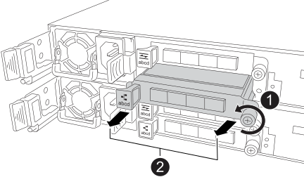

= Replace an I/O module - EF50 and EF80
:icons: font
:imagesdir: ../media/

[.lead]
Replace a failed I/O module in your EF50 or EF80 storage system with the same type of I/O module to restore the storage system to its optimal operating state. 

The replacement process involves placing the impaired controller offline, replacing the failed I/O module, bringing the controller back online, and returning the failed part to NetApp.

.Before you begin

* Schedule a downtime maintenance window for this procedure. You cannot access data on the storage system until you have successfully completed this procedure.

* Make sure that you are replacing the failed I/O module with the same type of I/O module. You cannot install a different type of I/O module. 
+
You must have the same type and number of I/O modules in each controller in your storage system.
+
CAUTION: *Possible loss of data access* -- The presence of incompatible or mismatched I/O modules causes the controllers to lock down when you apply power.
+
If needed, you can confirm supported I/O modules for your storage system at https://hwu.netapp.com[NetApp Hardware Universe^].

* Make sure you have the following:
** An ESD wristband, or you have taken other antistatic precautions.
** A flat, static-free surface.
** A management station with a browser that can access SANtricity System Manager for the controller.
+
To open the System Manager interface, point the browser to the controller's domain name or IP address.

* Unpack the replacement I/O module, and set it on a flat, static-free surface.
+
Save the packing materials to use when returning the failed I/O module to NetApp.

.About this task

* The term _I/O module_ is used to refer to the host interface cards (HICs) in this procedure.

== Step 1: Offline the impaired controller

Place the impaired controller offline so you can safely replace the failed I/O module.

.Steps

. If the controller is not already offline, take it offline now using SANtricity System Manager or CLI commands:

** Using SANtricity System Manager:
.. Select *Hardware*.
.. If the graphic shows the drives, select *Show back of shelf* to show the controllers.
.. Select the controller that you want to place offline.
.. From the context menu, select *Place offline*, and confirm that you want to perform the operation.
+
NOTE: If you are accessing SANtricity System Manager using the controller you are attempting to take offline, a SANtricity System Manager Unavailable message is displayed. Select Connect to an alternate network connection to automatically access SANtricity System Manager using the other controller.

** Using CLI commands:
+
*For controller A*: `set controller [a] availability=offline`
+
*For controller B*: `set controller [b] availability=offline`
. Wait for SANtricity System Manager to update the controller's status to offline.
+
CAUTION: Do not begin any other operations until after the status has been updated.

. Confirm it is safe to remove the I/O module, using the Recovery Guru:
.. Select *Recheck*.
.. Confirm that the *OK to remove* field in the Details area displays *Yes*.
+
CAUTION: If the *OK to remove* field does not display *Yes*, do not proceed with the removal of the I/O module. Instead, troubleshoot the issue using the Recovery Guru.

== Step 2: Replace the I/O module

Replace the failed I/O module with the replacement I/O module.

.Steps

. If you are not already grounded, properly ground yourself. 

. Unplug cabling from the failed I/O module.
+
Make sure to label the cables so that you know where they came from.

. Remove the failed I/O module from the controller:
+

+
[cols="1,4"]
|===
a|
image::../media/icon_round_1.png[Callout number 1]
a|
Turn the I/O module thumbscrew counterclockwise to loosen.
a|
image::../media/icon_round_2.png[Callout number 2]
a|
Pull the I/O module out of the controller using the port label tab on the left and the thumbscrew.

|===

. Install the replacement I/O module into the target slot:

.. Align the I/O module with the edges of the slot.

.. Gently push the I/O module all the way into the slot, making sure to properly seat the module into the connector.
+
You can use the tab on the left and the thumbscrew to push in the I/O Module.
+
.. Turn the thumbscrew clockwise to tighten.

. Cable the I/O module.

== Step 3: Bring the impaired controller online

Bring the impaired controller back online, collect support data, and resume operations.

.Steps

. Bring the impaired controller online using SANtricity System Manager or CLI commands.

** Using SANtricity System Manager:
.. Select *Hardware*.
.. If the graphic shows the drives, select *Show back of shelf*.
.. Select the controller you want to place online.
.. Select *Place Online* from the context menu, and confirm that you want to perform the operation.
+
The system places the controller online.

** Using CLI commands:
+
*For controller A*: `set controller [a] availability=online`;
+
*For controller B*: `set controller [b] availability=online`;

. When the controller is back online, check the controller shelf's Attention LEDs.
+
If the status is not Optimal or if any of the Attention LEDs are on, confirm that all cables are correctly seated.
+
NOTE: If you cannot resolve the problem, contact https://mysupport.netapp.com/site/global/dashboard[NetApp Support].
If needed, collect support data for your storage array using SANtricity System Manager.

. Verify that all volumes have been returned to their preferred owners using SANtricity System Manager:
.. Select *Storage > Volumes*. 
.. From the *All Volumes* page, verify that volumes are distributed to their preferred owners. 
.. Select *More > Change ownership* to view volume owners.

. The next step depends on whether the volumes are returned to their preferred owners:
+
Use SANtricity System Manager as needed.
+
[options="header" cols="1,2"]

|===
| If...| Then...
a|
Volumes are all owned by their preferred owners 
a|
Go to the next step.
a|
None of the volumes are returned to their preferred owners
a|
Go to *More > Redistribute volumes* to return the volumes to their preferred owners.
a|
Only some of the volumes are returned to their preferred owners after auto-distribution or manual distribution 
a|
Check the Recovery Guru for host connectivity issues.

If there is no Recovery Guru present or if following the recovery guru steps the volumes are still not returned to their preferred owners, contact https://mysupport.netapp.com/site/global/dashboard[NetApp Support] before continuing with this procedure.
|===

. Collect support data for your storage system using SANtricity System Manager.
.. Select *Support > Support Center > Diagnostics*.
.. Select *Collect Support Data*.
.. Click *Collect*.
+
The file is saved in the Downloads folder for your browser with the name, *support-data.7z*.

== Step 4: Return the failed part to NetApp

include::../_include/complete_rma.adoc[]

.What's next?

Your I/O module replacement is complete. You can resume normal operations.
