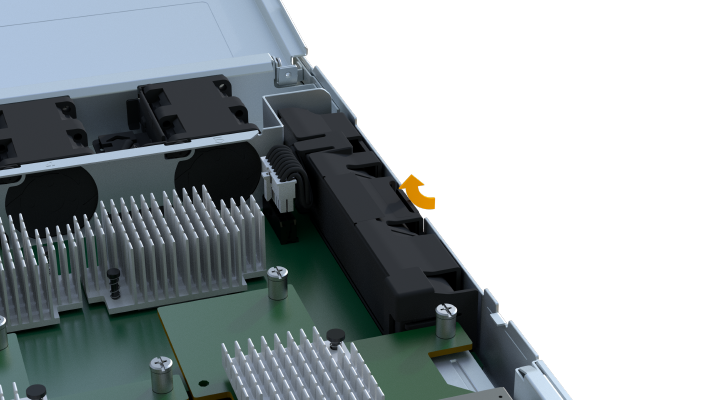
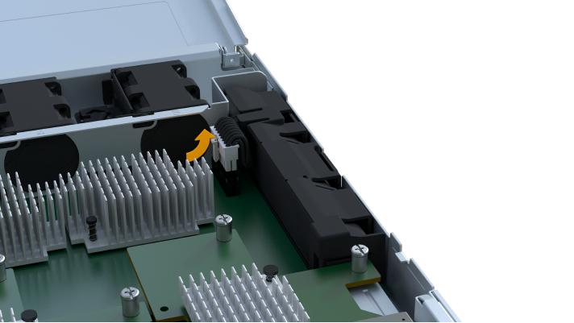
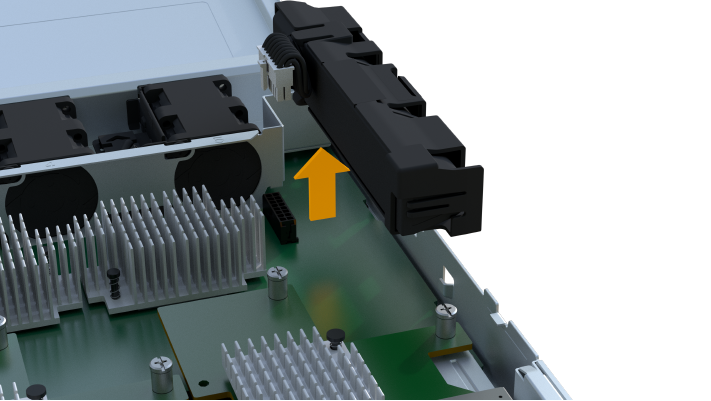
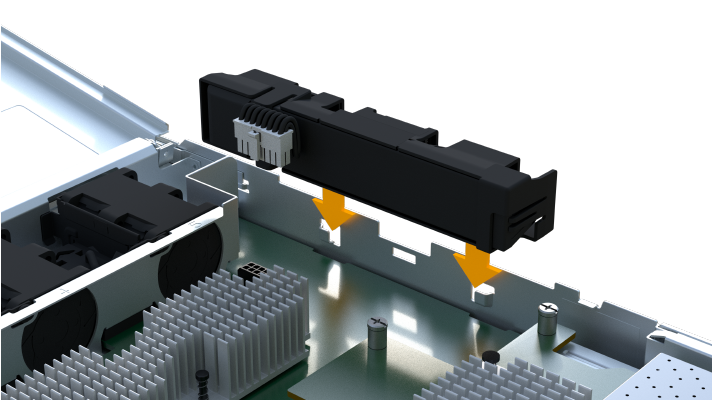

= Replace battery
:icons: font
:imagesdir: ../media/

[.lead]
Each controller canister includes a battery that preserves cached data if the AC power fails. If the Recovery Guru in SANtricity System Manager reports either a Battery Failed status or a Battery Replacement Required status, you must replace the affected battery.

== Place controller offline

[.lead]
You must place the affected controller offline so you can safely remove the failed battery. You must back up the configuration and collect support data first. Then, you can take the affected controller offline.

* Make sure that no volumes are in use or that you have a multipath driver installed on all hosts using these volumes.

. From SANtricity System Manager, review the details in the Recovery Guru to confirm that there is an issue with a battery and to ensure no other items must be addressed first.
. From the Details area of the Recovery Guru, determine which battery to replace.
. Back up the storage array's configuration database.
+
If a problem occurs when you remove a controller, you can use the saved file to restore your configuration.

 .. In System Manager, navigate to the support page.
 .. Select the *Support Center* tab.
 .. Select the *Diagnostics* tab.
 .. Select *Collect Support Data*.

. If the controller is not already offline, take it offline now using SANtricity System Manager.
 .. Select *Hardware*.
 .. If the graphic shows the drives, select *Show back of shelf* to show the controllers.
 .. Select the controller that you want to place offline.
 .. From the context menu, select *Place offline*, and confirm that you want to perform the operation.

+
NOTE: If you are accessing SANtricity System Manager using the controller you are attempting to take offline, a SANtricity System Manager Unavailable message is displayed. Select *Connect to an alternate network connection* to automatically access SANtricity System Manager using the other controller.
. Wait for SANtricity System Manager to update the controller's status to offline.
+
IMPORTANT: Do not begin any other operations until after the status has been updated.

. Select *Recheck* from the Recovery Guru, and confirm that the OK to remove field in the Details area displays Yes, indicating that it is safe to remove this component.

Go to link:concept_replace_battery.md#[Remove controller canister].

== Remove controller canister

[.lead]
You remove the controller canister so you can replace the failed battery with a new one. Disconnect all the cables then you can slide the controller out of the controller shelf.

* You must use labels to identify each cable that is connected to the controller canister.
* You have an ESD wristband, or you have taken other antistatic precautions.
* You have prepared a flat, static free work area.

. Put on an ESD wristband or take other antistatic precautions.
. Label each cable that is attached to the controller canister.
. Disconnect all the cables from the controller canister.
+
IMPORTANT: To prevent degraded performance, do not twist, fold, pinch, or step on the cables.

. Confirm that the Cache Active LED on the back of the controller is off.
. Squeeze the handles on either side of the controller, and pull back until it releases from the shelf.
+
image::../media/remove_controller_5.png[]

. Using two hands and the handles, slide the controller canister out of the shelf. When the front of the controller is free of the enclosure, use two hands to pull it out completely.
+
IMPORTANT: Always use two hands to support the weight of a controller canister.
+
image::../media/remove_controller_6.png[]

. Place the controller canister on a flat, static-free surface.

Go to link:concept_replace_battery.md#[Remove failed battery].

== Remove failed battery

[.lead]
You must remove the failed battery so you can install the new one. Remove the battery by squeezing the tab and disconnecting the connector housing. Then, you can pull the battery out of the controller.

. Remove the controller canister's cover by unscrewing the single thumbscrew and lifting the lid open.
. Confirm that the green LED inside the controller is off.
+
If this green LED is on, the controller is still using battery power. You must wait for this LED to go off before removing any components.

. Locate the 'press' tab on the side of the controller.
. Unlatch the battery by pressing the tab and squeezing the battery casing.
+

. Gently squeeze the connector housing the battery wiring. Pull up, disconnecting the battery from the board.
+

. Lift the battery out of the controller and place on a flat, static-free surface.
+

. Follow the appropriate procedures for your location to recycle or dispose of the failed battery.
+
WARNING: To comply with International Air Transport Association (IATA) regulations, never ship a lithium battery by air unless it is installed within the controller shelf.

Go to link:concept_replace_battery.md#[Install new battery].

== Install new battery

[.lead]
You must install a new battery when the old one has failed. Align the new battery with the side of the controller and then plug the connector into the board.

* You have removed the failed battery from the controller canister.
* You have the replacement battery.
* You have an ESD wristband, or you have taken other antistatic precautions.

. Unpack the new battery, and set it on a flat, static-free surface.
+
IMPORTANT: To comply with IATA safely regulations, replacement batteries are shipped with a state of charge (SoC) of 30 percent or less. When you reapply power, keep in mind that write caching does not resume until the replacement battery is fully charged and it has completed its initial learn cycle.

. Insert the battery into the controller by lining up the battery casing with the metal latches on the side of the controller.
+

+
The battery clicks into place.

. Plug the battery connector back into the board.

Go to link:concept_replace_battery.md#[Reinstall controller canister].

== Reinstall controller canister

[.lead]
After you install the new battery, you reinstall the controller into the controller shelf. Close the cover and use the handles to slide the controller into the controller shelf.

. Lower the cover on the controller canister and secure the thumbscrew.
. While squeezing the controller handles, gently slide the controller canister all the way into the controller shelf.
+
NOTE: The controller audibly clicks when correctly installed into the shelf.
+
image::../media/remove_controller_7.png[]

Go to link:concept_replace_battery.md#[Complete battery replacement].

== Complete battery replacement

[.lead]
You complete a battery replacement by placing the controller online to confirm the new battery is working correctly. Then, you can collect support data and resume operations.

. Place controller online.
 .. In System Manager, navigate to the hardware page.
 .. Select *Show back of controller*.
 .. Select the controller with the replaced battery.
 .. Select *Place online* from the drop-down list.
. As the controller boots, check the controller LEDs.
+
When communication with the other controller is reestablished:

 ** The amber Attention LED remains on.
 ** The Host Link LEDs might be on, blinking, or off, depending on the host interface.

. When the controller is back online, confirm that its status is Optimal and check the controller shelf's Attention LEDs.
+
If the status is not Optimal or if any of the Attention LEDs are on, confirm that all cables are correctly seated, and the controller canister is installed correctly. If necessary, remove and reinstall the controller canister.
+
NOTE: If you cannot resolve the problem, contact technical support.

. Click *Support* > *Upgrade Center* to ensure that the latest version of SANtricity OS is installed.
+
As needed, install the latest version.

. Verify that all volumes have been returned to the preferred owner.
 .. Select *Storage* > *Volumes*. If current owner and preferred owner are not listed select *All volumes* > *Columns*. Select current owner and preferred owner, and then recheck to verify that volumes are distributed to their preferred owners.
 .. If volumes are all owned by preferred owner continue to Step 6.
 .. If none of the volumes are returned, you must manually return the volumes. Go to *Storage* > *Volumes* > *More* > *Redistribute volumes*.
 .. If only some of the volumes are returned to their preferred owners after auto-distribution or manual distribution you must check the recovery guru for host connectivity issues.
 .. If there is no recovery guru present or if following the recovery guru steps the volumes are still not returned to their preferred owners contact support.
. Collect support data for your storage array using SANtricity System Manager.
 .. Select *Support* > *Support Center* > *Diagnostics*.
 .. Select *Collect Support Data*.
 .. Click *Collect*.
The file is saved in the Downloads folder for your browser with the name support-data.7z.

Your battery replacement is complete. You can resume normal operations.
