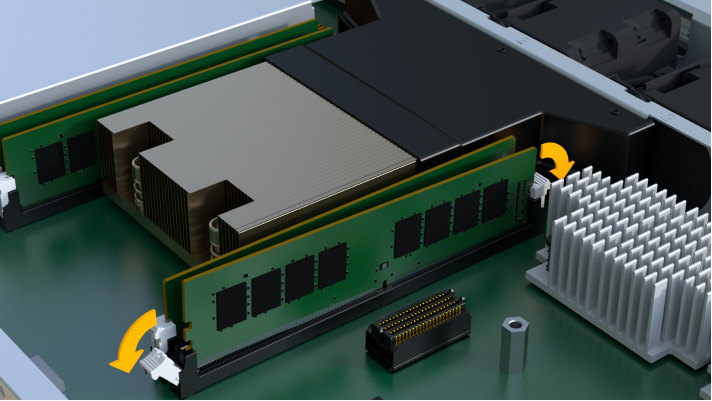
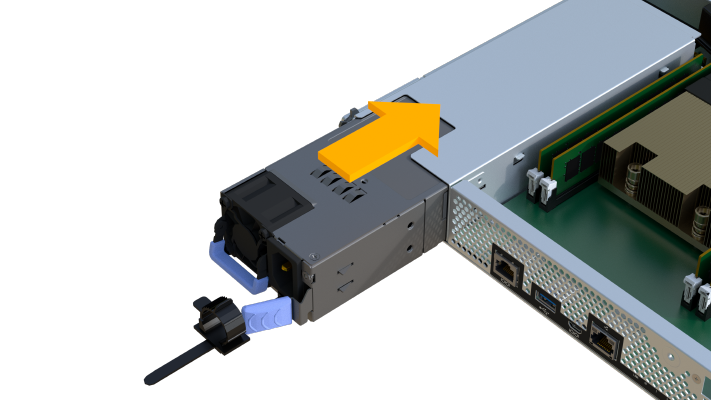

= Replace EF300 or EF600 controller
:icons: font
:imagesdir: ../media/

[.lead]
Follow these steps to replace a single controller in your EF300 or EF600 controller shelf.

== About this task
When you replace a failed controller canister, you must remove the battery, power supply, DIMMs, fans, and host interface card (HIC) from the original controller canister, and then install them in the replacement controller canister.

== Before you begin

* Review link:controllers_overview_supertask_concept[Requirements for EF300 or EF600 controller replacement].
* Determine if you have a failed controller canister in one of two ways:
** The Recovery Guru in SANtricity System Manager directs you to replace the controller canister.
** The amber Attention LED on the controller canister is on, indicating that the controller has a fault.

== Step 1: Prepare to replace controller

Prepare to replace a failed controller canister.

=.Steps

. Unpack the new controller canister, and set it on a flat, static-free surface.
+
Save the packing materials to use when shipping the failed controller canister.

. Locate the MAC address and FRU part number labels on the back of the controller canister.
. From SANtricity System Manager, locate the replacement part number for the controller canister you are replacing.
+
When a controller has a fault and needs to be replaced, the replacement part number is displayed in the Details area of the Recovery Guru. If you need to find this number manually, follow these steps:

 .. Select *Hardware*.
 .. Locate the controller shelf, which is marked with the controller icon image:../media/sam1130_ss_hardware_controller_icon_maint-ef600.gif[].
 .. Click the controller icon.
 .. Select the controller, and click *Next*.
 .. On the *Base* tab, make a note of the *Replacement Part Number* for the controller.

. Confirm that the replacement part number for the failed controller is the same as the FRU part number for the replacement controller.
+
CAUTION: *Possible loss of data access* -- If the two-part numbers are not the same, do not attempt this procedure. In addition, if the failed controller canister includes a host interface card (HIC), you must install that HIC into the new controller canister. The presence of mismatched controllers or HICs causes the new controller to lock down when you bring it online.

. Back up the storage array's configuration database.
+
If a problem occurs when you remove a controller, you can use the saved file to restore your configuration.

 .. In System Manager, navigate to the support page.
 .. Select the *Support Center* tab.
 .. Select *Diagnostics* tab.
 .. Select the *Collect Support Data*.

. If the controller is not already offline, take it offline now using SANtricity System Manager.
 .. Select *Hardware*.
 .. If the graphic shows the drives, select *Show back of shelf* to show the controllers.
 .. Select the controller that you want to place offline.
 .. From the context menu, select *Place offline*, and confirm that you want to perform the operation.

+
NOTE: If you are accessing SANtricity System Manager using the controller you are attempting to take offline, a SANtricity System Manager Unavailable message is displayed. Select *Connect to an alternate network connection* to automatically access SANtricity System Manager using the other controller.
. Wait for SANtricity System Manager to update the controller's status to offline.
+
NOTE: Do not begin any other operations until after the status has been updated.

. Select *Recheck* from the Recovery Guru, and confirm that the *OK to remove* field in the Details area displays *Yes*, indicating that it is safe to remove this component.

== Step 2: Remove failed controller

Remove a controller canister to replace the failed canister with a new one.

This is a multi-step procedure that requires you to remove the following components: battery, host interface card, power supply, DIMMs, and fans.

=== Step 2a: Remove controller canister

Remove the failed controller canister so you can replace it with a new one.

===== What you'll need

* Labels to identify each cable that is connected to the controller canister.
* An ESD wristband, or you have taken other antistatic precautions.
* A flat, static free work area.

=.Steps

. Put on an ESD wristband or take other antistatic precautions.
. Label each cable that is attached to the controller canister.
. Disconnect all the cables from the controller canister.
+
CAUTION: To prevent degraded performance, do not twist, fold, pinch, or step on the cables.

. If the controller canister has a HIC that uses SFP+ transceivers, remove the SFPs.
+
Because you must remove the HIC from the failed controller canister, you must remove any SFPs from the HIC ports. When you reconnect the cables, you can move those SFPs to the new controller canister.

. Confirm that the Cache Active LED on the back of the controller is off.
. Squeeze the handles on either side of the controller, and pull back until it releases from the shelf.
+
image::../media/remove_controller_5.png[]

. Using two hands and the handles, slide the controller canister out of the shelf. When the front of the controller is free of the enclosure, use two hands to pull it out completely.
+
CAUTION: Always use two hands to support the weight of a controller canister.
+
image::../media/remove_controller_6.png[]

. Place the controller canister on a flat, static-free surface.

=== Step 2b: Remove battery

Remove the battery from the failed controller canister so you can install it in the new controller canister.

=.Steps

. Remove the controller canister's cover by unscrewing the single thumbscrew and lifting the lid open.
. Locate the 'press' tab on the side of the controller.
. Unlatch the battery by pressing the tab and squeezing the battery casing.
+
image::../media/batt_3.png[]

. Gently squeeze the connector housing the battery wiring. Pull up, disconnecting the battery from the board.image:../media/batt_2.png[]
. Lift the battery out of the controller and place on a flat, static-free surface.image:../media/batt_4.png[]

=== Step 2c: Remove the HIC

If the controller canister includes a HIC, you must remove the HIC from the original controller canister. Otherwise, you can skip this step.

===== What you'll need

* A #1 Phillips screwdriver.

=.Steps

. Using a Phillips screwdriver, remove the two screws that attach the HIC faceplate to the controller canister.
+
image::../media/hic_2.png[]
+
NOTE: The image above is an example, the appearance of your HIC may differ.

. Remove the HIC faceplate.
. Using your fingers or a Phillips screwdriver, loosen the single thumbscrew that secure the HIC to the controller card.
+
image::../media/hic_3.png[]
+
NOTE: The HIC comes with three screw locations on the top but is secured with only one.

. Carefully detach the HIC from the controller card by lifting the card up and out of the controller.
+
CAUTION: Be careful not to scratch or bump the components on the bottom of the HIC or on the top of the controller card.
+
image::../media/hic_4.png[]

. Place the HIC on a flat, static-free surface.

=== Step 2d: Remove power supply

Remove the power supply so you can install it in the new controller.

===== What you'll need

* An ESD wristband, or you have taken other antistatic precautions.

=.Steps

. Disconnect the power cables:
 .. Open the power cord retainer, and then unplug the power cord from the power supply.
 .. Unplug the power cord from the power source.
. Locate the tab to the right of the power supply and press it towards the power supply unit.
+
image::../media/psup_2.png[]

. Locate the handle on the front of the power supply.
. Use the handle to slide the power supply straight out of the system.
+
image::../media/psup_3.png[]
+
CAUTION: When removing a power supply, always use two hands to support its weight.

=== Step 2e: Remove DIMMs

Remove the DIMMs so you can install them in the new controller.

===== What you'll need

* An ESD wristband, or you have taken other antistatic precautions.

=.Steps

. Locate the DIMMs on your controller.
. Note the orientation of the DIMM in the socket so that you can insert the replacement DIMM in the proper orientation.
+
NOTE: A notch at the bottom of the DIMM helps you align the DIMM during installation.

. Slowly push apart on the two DIMM ejector tabs on either side of the DIMM to eject the DIMM from its slot, and then slide it out of the slot.
+
NOTE: Carefully hold the DIMM by the edges to avoid pressure on the components on the DIMM circuit board.
+

+
image::../media/dimim_3.png[]

=== Step 2f: Remove fans

Remove the fans so you can install them in the new controller.

===== What you'll need

* An ESD wristband, or you have taken other antistatic precautions.

=.Steps

. Gently lift the fan from the controller.
+
image::../media/fan_2.png[]

. Repeat until all fans are removed.

== Step 3: Install new controller

Install a new controller canister to replace the failed one.

This is a multi-step procedure that requires you to install the following components from the original controller: battery, host interface card, power supply, DIMMs, and fans.

=== Step 3a: Install battery

Install the battery into the replacement controller canister.

===== What you'll need

* The battery from the original controller canister, or a new battery that you ordered.
* The replacement controller canister.
* An ESD wristband, or you have taken other antistatic precautions.

=.Steps

. Insert the battery into the controller by lining up the battery casing with the metal latches on the side of the controller.
+
image::../media/batt_5.png[]
+
The battery clicks into place.

. Plug the battery connector back into the board.

=== Step 3b: Install the HIC

If you removed a HIC from the original controller canister, you must install that HIC in the new controller canister. Otherwise, you can skip this step.

===== What you'll need

* A replacement controller canister with the same part number as the controller canister you are replacing.
* A #1 Phillips screwdriver.
* An ESD wristband, or you have taken other antistatic precautions.

=.Steps

. Using a #1 Phillips screwdriver, remove the two screws that attach the blank faceplate to the replacement controller canister, and remove the faceplate.
. Align the single thumbscrew on the HIC with the corresponding hole on the controller, and align the connector on the bottom of the HIC with the HIC interface connector on the controller card.
+
Be careful not to scratch or bump the components on the bottom of the HIC or on the top of the controller card.
+
image::../media/hic_7.png[]
+
NOTE: The image above is an example; the appearance of your HIC may differ.

. Carefully lower the HIC into place, and seat the HIC connector by pressing gently on the HIC.
+
CAUTION: *Possible equipment damage* -- Be very careful not to pinch the gold ribbon connector for the controller LEDs between the HIC and the thumbscrew.

. Hand-tighten the HIC thumbscrew.
+
Do not use a screwdriver, or you might over tighten the screw.
+
image::../media/hic_3.png[]
+
NOTE: The image above is an example; the appearance of your HIC may differ.

. Using a #1 Phillips screwdriver, attach the HIC faceplate you removed from the original controller canister to the new controller canister with the two screws.

=== Step 3c: Install power supply

Install the power supply into the replacement controller canister.

=.Steps

. Using both hands, support and align the edges of the power supply with the opening in the system chassis, and then gently push the power supply into the chassis using the cam handle.
+
The power supplies are keyed and can only be installed one way.
+
CAUTION: Do not use excessive force when sliding the power supply into the system; you can damage the connector.
+

=== Step 3d: Install DIMMs

Install the DIMMs into the new controller canister.

===== What you'll need

* An ESD wristband, or you have taken other antistatic precautions.

=.Steps

. Hold the DIMM by the corners, and align it to the slot.
+
The notch among the pins on the DIMM should line up with the tab in the socket.

. Insert the DIMM squarely into the slot.
+
image::../media/dimm_4.png[]
+
The DIMM fits tightly in the slot, but should go in easily. If not, realign the DIMM with the slot and reinsert it.
+
NOTE: Visually inspect the DIMM to verify that it is evenly aligned and fully inserted into the slot.

. Push carefully, but firmly, on the top edge of the DIMM until the latches snap into place over the notches at the ends of the DIMM.
+
NOTE: DIMMs fit tightly. You might need to gently press on one side at a time and secure with each tab individually.
+
image::../media/dimm_5.png[]

=== Step 3e: Install fans

Install the fans into the replacement controller canister.

===== What you'll need

* An ESD wristband, or you have taken other antistatic precautions.

=.Steps

. Slide the fan all the way into the replacement controller.
+
image::../media/fan_3.png[]
+
image::../media/fan_3_a.png[]

. Repeat until all fans are installed.

=== Step 3f: Install new controller canister

Last, install the new controller canister into the controller shelf.

=.Steps

. Lower the cover on the controller canister and secure the thumbscrew.
. While squeezing the controller handles, gently slide the controller canister all the way into the controller shelf.
+
NOTE: The controller audibly clicks when correctly installed into the shelf.
+
image::../media/remove_controller_7.png[]

. Install the SFPs from the original controller in the host ports on the new controller, if they were installed in the original controller, and reconnect all the cables.
+
If you are using more than one host protocol, be sure to install the SFPs in the correct host ports.

. If the original controller used DHCP for the IP address, locate the MAC address on the label on the back of the replacement controller. Ask your network administrator to associate the DNS/network and IP address for the controller you removed with the MAC address for the replacement controller.
+
NOTE: If the original controller did not use DHCP for the IP address, the new controller adopts the IP address of the controller you removed.

== Step 4: Complete controller replacement

Place the controller online, collect support data, and resume operations.

=.Steps

. Place controller online.
 .. In System Manager, navigate to the Hardware page.
 .. Select *Show back of controller*.
 .. Select the replaced controller.
 .. Select *Place online* from the drop-down list.
. As the controller boots, check the controller LEDs.
+
When communication with the other controller is reestablished:

 ** The amber Attention LED remains on.
 ** The Host Link LEDs might be on, blinking, or off, depending on the host interface.

. When the controller is back online, confirm that its status is Optimal and check the controller shelf's Attention LEDs.
+
If the status is not Optimal or if any of the Attention LEDs are on, confirm that all cables are correctly seated and the controller canister is installed correctly. If necessary, remove and reinstall the controller canister.
+
NOTE: If you cannot resolve the problem, contact technical support.

. Click *Hardware* > *Support* > *Upgrade Center* to ensure that the latest version of SANtricity OS is installed.
+
As needed, install the latest version.

. Verify that all volumes have been returned to the preferred owner.
 .. Select *Storage* > *Volumes*. If current owner and preferred owner are not listed select *All volumes* > *Columns.* Select current owner and preferred owner, and then recheck to verify that volumes are distributed to their preferred owners.
 .. If volumes are all owned by preferred owner continue to Step 6.
 .. If none of the volumes are returned, you must manually return the volumes. Go to *Storage* > *Volumes* > *More* > *Redistribute volumes*.
 .. If only some of the volumes are returned to their preferred owners after auto-distribution or manual distribution you must check the Recovery Guru for host connectivity issues.
 .. If there is no Recovery Guru present or if following the recovery guru steps the volumes are still not returned to their preferred owners contact support.
. Collect support data for your storage array using SANtricity System Manager.
 .. Select *Support* > *Support Center* > *Diagnostics*.
 .. Select *Collect Support Data*.
 .. Click *Collect*.
The file is saved in the Downloads folder for your browser with the name support-data.7z.

== Result

Your controller replacement is complete. You can resume normal operations.
