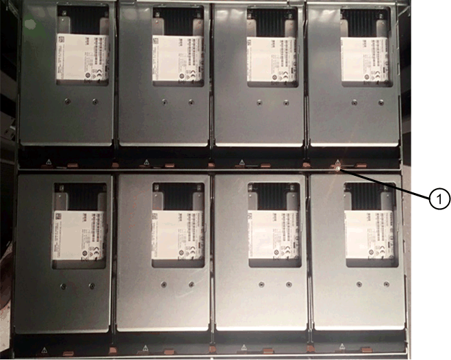

= Replace drive in an EF300 array
:icons: font
:imagesdir: ../media/

[.lead]
You can replace a drive in an EF300 array.

The EF300 supports SAS expansion with 24-drive and 60-drive shelves. The procedure you follow depends on whether you have a 24-drive shelf or a 60-drive shelf:

* <<Replace drive in an EF300 (24-drive shelf)>>
* <<Replace drive in an EF300 (60-drive shelf)>>

== Replace drive in an EF300 (24-drive shelf)
:icons: font
:imagesdir: ../media/

Follow this procedure to replace a drive in a 24-drive shelf.

.About this task

The Recovery Guru in SANtricity System Manager monitors the drives in the storage array and can notify you of an impending drive failure or an actual drive failure. When a drive has failed, its amber Attention LED is on. You can hot-swap a failed drive while the storage array is receiving I/O.

.Before you begin

* Review drive handling requirements in link:drives-overview-supertask-concept.html[Requirements for EF300 or EF600 drive replacement].

.What you'll need

* A replacement drive that is supported by NetApp for your controller shelf or drive shelf.
* An ESD wristband, or you have taken other antistatic precautions.
* A flat, static-free work surface.
* A management station with a browser that can access SANtricity System Manager for the controller. (To open the System Manager interface, point the browser to the controller's domain name or IP address.)

=== Step 1: Prepare to replace drive (24-drive)

Prepare to replace a drive by checking the Recovery Guru in SANtricity System Manager and completing any prerequisite steps. Then, you can locate the failed component.

.Steps

. If the Recovery Guru in SANtricity System Manager has notified you of an _impending drive failure_, but the drive has not yet failed, follow the instructions in the Recovery Guru to fail the drive.
. If needed, use SANtricity System Manager to confirm you have a suitable replacement drive.
 .. Select *Hardware*.
 .. Select the failed drive on the shelf graphic.
 .. Click the drive to display its context menu, and then select *View settings*.
 .. Confirm that the replacement drive has a capacity equal to or greater than the drive you are replacing and that it has the features you expect.
+
For example, do not attempt to replace a hard disk drive (HDD) with a solid-state drive (SSD). Similarly, if you are replacing a secure-capable drive, make sure the replacement drive is also secure-capable.
. If needed, use SANtricity System Manager to locate the drive within your storage array: From the drive's context menu, select *Turn on locator light*.
+
The drive's Attention LED (amber) blinks so you can identify which drive to replace.
+
NOTE: If you are replacing a drive in a shelf that has a bezel, you must remove the bezel to see the drive LEDs.

=== Step 2: Remove failed drive (24-drive)

Remove a failed drive to replace it with a new one.

.Steps

. Unpack the replacement drive, and set it on a flat, static-free surface near the shelf.
+
Save all packing materials.

. Press the release button on the failed drive.
+
image::../media/drw_drive_latch_maint-e5700.gif[]

 ** For drives in E5724 controller shelves or DE224C drive shelves, the release button is located at the top of the drive.
The cam handle on the drive springs open partially, and the drive releases from the midplane.

. Open the cam handle, and slide out the drive slightly.
. Wait 30 seconds.
. Using both hands, remove the drive from the shelf.
. Place the drive on an antistatic, cushioned surface away from magnetic fields.
. Wait 30 seconds for the software to recognize that the drive has been removed.
+
NOTE: If you accidentally remove an active drive, wait at least 30 seconds, and then reinstall it. For the recovery procedure, refer to the storage management software.

=== Step 3: Install new drive (24-drive)

You install a new drive to replace the failed one. Install the replacement drive as soon as possible after removing the failed drive. Otherwise, there is a risk that the equipment might overheat.

.Steps

. Open the cam handle.
. Using two hands, insert the replacement drive into the open bay, firmly pushing until the drive stops.
. Slowly close the cam handle until the drive is fully seated in the midplane and the handle clicks into place.
+
The green LED on the drive comes on when the drive is inserted correctly.
+
NOTE: Depending on your configuration, the controller might automatically reconstruct data to the new drive. If the shelf uses hot spare drives, the controller might need to perform a complete reconstruction on the hot spare before it can copy the data to the replaced drive. This reconstruction process increases the time that is required to complete this procedure.

=== Step 4: Complete drive replacement (24-drive)

Confirm that the new drive is working correctly.

.Steps

. Check the Power LED and the Attention LED on the drive you replaced.
+
When you first insert a drive, its Attention LED might be on. However, the LED should go off within a minute.

 ** Power LED is on or blinking, and the Attention LED is off: Indicates that the new drive is working correctly.
 ** Power LED is off: Indicates that the drive might not be installed correctly. Remove the drive, wait 30 seconds, and then reinstall it.
 ** Attention LED is on: Indicates that the new drive might be defective. Replace it with another new drive.

. If the Recovery Guru in SANtricity System Manager still shows an issue, select *Recheck* to ensure the problem has been resolved.
. If the Recovery Guru indicates that drive reconstruction did not start automatically, start reconstruction manually, as follows:
+
NOTE: Perform this operation only when instructed to do so by technical support or the Recovery Guru.

 .. Select *Hardware*.
 .. Click the drive that you replaced.
 .. From the drive's context menu, select *Reconstruct*.
 .. Confirm that you want to perform this operation.
+
When the drive reconstruction completes, the volume group is in an Optimal state.

. As required, reinstall the bezel.
. Return the failed part to NetApp, as described in the RMA instructions shipped with the kit.

.What's next?

Your drive replacement is complete. You can resume normal operations.

== Replace drive in an EF300 (60-drive shelf)

Follow this procedure to replace a drive in a 60-drive shelf.

.About this task

The Recovery Guru in SANtricity System Manager monitors the drives in the storage array and can notify you of an impending drive failure or an actual drive failure. When a drive has failed, its amber Attention LED is on. You can hot-swap a failed drive while the storage array is receiving I/O operations.

.Before you begin

* Review drive handling requirements in link:drives-overview-supertask-concept.html[Requirements for EF300 or EF600 drive replacement].

.What you'll need

* A replacement drive that is supported by NetApp for your controller shelf or drive shelf.
* An ESD wristband, or you have taken other antistatic precautions.
* A management station with a browser that can access SANtricity System Manager for the controller. (To open the System Manager interface, point the browser to the controller's domain name or IP address.)

=== Step 1: Prepare to replace drive (60-drive)

Prepare to replace a drive by checking the Recovery Guru in SANtricity System Manager and completing any prerequisite steps. Then, you can locate the failed component.

.Steps

. If the Recovery Guru in SANtricity System Manager has notified you of an _impending drive failure_, but the drive has not yet failed, follow the instructions in the Recovery Guru to fail the drive.
. If needed, use SANtricity System Manager to confirm you have a suitable replacement drive.
 .. Select *Hardware*.
 .. Select the failed drive on the shelf graphic.
 .. Click the drive to display its context menu, and then select *View settings*.
 .. Confirm that the replacement drive has a capacity equal to or greater than the drive you are replacing and that it has the features you expect.
+
For example, do not attempt to replace a hard disk drive (HDD) with a solid-state disk (SSD). Similarly, if you are replacing a secure-capable drive, make sure the replacement drive is also secure-capable.
. If needed, use SANtricity System Manager to locate the drive within the storage array.
 .. If the shelf has a bezel, remove it so you can see the LEDs.
 .. From the drive's context menu, select *Turn on locator light*.
+
The drive drawer's Attention LED (amber) blinks so you can open the correct drive drawer to identify which drive to replace.
+
image::../media/2860_dwg_attn_led_on_drawer_maint-e5700.gif[]
+
*(1)* _Attention LED_

 .. Unlatch the drive drawer by pulling on both levers.
 .. Using the extended levers, carefully pull the drive drawer out until it stops.
 .. Look at the top of the drive drawer to find the Attention LED in front of each drive.
+

+
*(1)* _Attention LED light on for the drive on the top right side_
+
The drive drawer Attention LEDs are on the left side in front of each drive, with an attention icon on the drive handle just behind the LED.
+
image::../media/28_dwg_e2860_de460c_attention_led_drive_maint-e5700.gif[]
+
*(1)* _Attention icon_
+
*(2)* _Attention LED_

=== Step 2: Remove failed drive (60-drive)

Remove a failed drive to replace it with a new one.

.Steps

. Unpack the replacement drive, and set it on a flat, static-free surface near the shelf.
+
Save all packing materials for the next time you need to send a drive back.

. Release the drive drawer levers from the center of the appropriate drive drawer by pulling both towards the sides of the drawer.
. Carefully pull on the extended drive drawer levers to pull out the drive drawer to its full extension without removing it from the enclosure.
. Gently pull back the orange release latch that is in front of the drive you want to remove.
+
The cam handle on the drive springs open partially, and the drive is released from the drawer.
+
image::../media/trafford_drive_rel_button_maint-e5700.gif[]
+
*(1)* _Orange release latch_

. Open the cam handle, and lift out the drive slightly.
. Wait 30 seconds.
. Use the cam handle to lift the drive from the shelf.
+
image::../media/92_dwg_de6600_install_or_remove_drive_maint-e5700.gif[]

. Place the drive on an antistatic, cushioned surface away from magnetic fields.
. Wait 30 seconds for the software to recognize that the drive has been removed.
+
NOTE: If you accidentally remove an active drive, wait at least 30 seconds, and then reinstall it. For the recovery procedure, refer to the storage management software.

=== Step 3: Install new drive (60-drive)

Install a new drive to replace the failed one.

CAUTION: *Possible loss of data access* -- When pushing the drive drawer back into the enclosure, never slam the drawer shut. Push the drawer in slowly to avoid jarring the drawer and causing damage to the storage array.

.Steps

. Raise the cam handle on the new drive to vertical.
. Align the two raised buttons on each side of the drive carrier with the matching gap in the drive channel on the drive drawer.
+
image::../media/28_dwg_e2860_de460c_drive_cru_maint-e5700.gif[]
+
*(1)* _Raised button on the right side of the drive carrier_

. Lower the drive straight down, and then rotate the cam handle down until the drive snaps into place under the orange release latch.
. Carefully push the drive drawer back into the enclosure. Push the drawer in slowly to avoid jarring the drawer and causing damage to the storage array.
. Close the drive drawer by pushing both levers towards the center.
+
The green Activity LED for the replaced drive on the front of the drive drawer comes on when the drive is inserted correctly.
+
Depending on your configuration, the controller might automatically reconstruct data to the new drive. If the shelf uses hot spare drives, the controller might need to perform a complete reconstruction on the hot spare before it can copy the data to the replaced drive. This reconstruction process increases the time that is required to complete this procedure.

=== Step 4: Complete drive replacement (60-drive)

Confirm that the new drive is working correctly.

.Steps

. Check the Power LED and the Attention LED on the drive you replaced. (When you first insert a drive, its Attention LED might be on. However, the LED should go off within a minute.)
 ** Power LED is on or blinking, and the Attention LED is off: Indicates that the new drive is working correctly.
 ** Power LED is off: Indicates that the drive might not be installed correctly. Remove the drive, wait 30 seconds, and then reinstall it.
 ** Attention LED is on: Indicates that the new drive might be defective. Replace it with another new drive.
. If the Recovery Guru in SANtricity System Manager still shows an issue, select *Recheck* to ensure the problem has been resolved.
. If the Recovery Guru indicates that drive reconstruction did not start automatically, start reconstruction manually, as follows:
+
NOTE: Perform this operation only when instructed to do so by technical support or the Recovery Guru.

 .. Select *Hardware*.
 .. Click the drive that you replaced.
 .. From the drive's context menu, select *Reconstruct*.
 .. Confirm that you want to perform this operation.
+
When the drive reconstruction completes, the volume group is in an Optimal state.

. As required, reinstall the bezel.
. Return the failed part to NetApp, as described in the RMA instructions shipped with the kit.

.What's next?

Your drive replacement is complete. You can resume normal operations.
