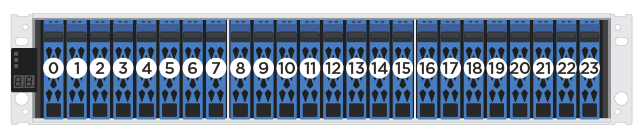
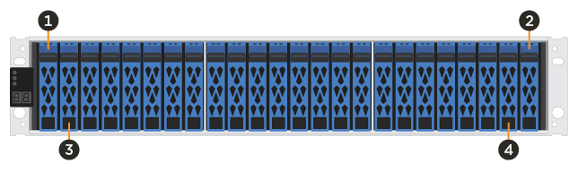

= Overview and requirements
:icons: font
:imagesdir: ../media/

[.lead]
Before you replace a drive, you need to be aware of certain requirements and considerations.

== Requirements for replacing drives

[.lead]
The drives in your storage array are fragile. Improper drive handling is a leading cause of drive failure.

Follow these rules to avoid damaging the drives in your storage array:

* Prevent electrostatic discharge (ESD):
 ** Keep the drive in the ESD bag until you are ready to install it.
 ** Open the ESD bag by hand or cut the top off with a pair of scissors. Do not insert a metal tool or knife into the ESD bag.
 ** Keep the ESD bag and any packing materials in case you must return a drive later.
 ** Always wear an ESD wrist strap grounded to an unpainted surface on your storage enclosure chassis. If a wrist strap is unavailable, touch an unpainted surface on your storage enclosure chassis before handling the drive.
* Handle drives carefully:
 ** Always use two hands when removing, installing, or carrying a drive.
 ** Never force a drive into a shelf, and use gentle, firm pressure to completely engage the drive latch.
 ** Place drives on cushioned surfaces, and never stack drives on top of each other.
 ** Do not bump drives against other surfaces.
 ** Before removing a drive from a shelf, unlatch the handle and wait 30 seconds for the drive to spin down.
 ** Always use approved packaging when shipping drives.
* Avoid magnetic fields:
 ** Keep drives away from magnetic devices.
+
Magnetic fields can destroy all data on the drive and cause irreparable damage to the drive circuitry.

=== 24-drive shelves

*Drive numbering in an EF300 or EF600 controller shelf*

The following figure shows how the drives are numbered in each shelf (the shelf's front bezel has been removed).

*Drive staggering in an EF300 or EF600 controller shelf*

When inserting fewer than 24 drives into an EF300 or EF600 controller, you must alternate between the two halves of the controller. Beginning with the far left and then moving to the far right, place the drives in one at a time.

The following figure shows how to stagger the drives between the two halves.

This section describes how to replace a drive in the following controller shelves:

* EF300 controller shelf
* EF600 controller shelf
