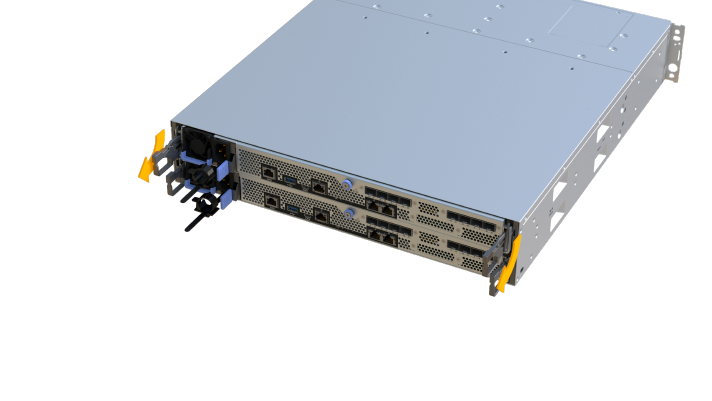
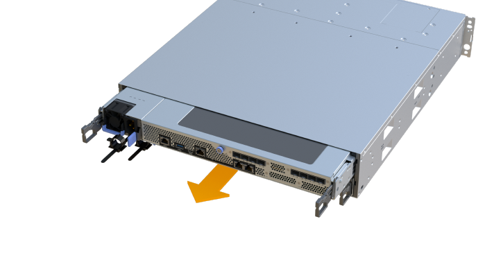
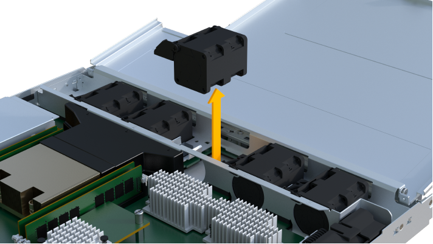
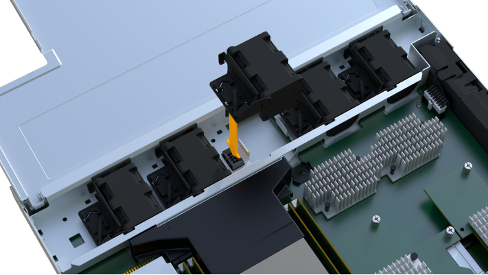
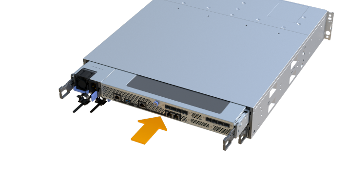

= Replace an EF300 or EF600 fan
:experimental:
:icons: font
:imagesdir: ../media/

[.lead]
You can replace a fan in an EF300, EF600, EF300C, or EF600C array.

.About this task
Each EF300 and EF600 controller shelf or drive shelf includes five fans. If a fan fails, you must replace it as soon as possible to ensure that the shelf has adequate cooling.

.Before you begin

Make sure you have the following:

* A replacement fan.
* An ESD wristband, or you have taken other antistatic precautions.
* A flat, static free work area.
* Labels to identify each cable that is connected to the controller canister.
* A management station with a browser that can access SANtricity System Manager for the controller. (To open the System Manager interface, point the browser to the controller's domain name or IP address.)

== Step 1: Place controller offline

Place the controller canister offline so you can safely replace the failed fan.

.Steps

. From SANtricity System Manager, review the details in the Recovery Guru to confirm that there is an issue with a fan and to ensure no other items must be addressed first.
. From the Details area of the Recovery Guru, determine which fan to replace.
. Back up the storage array's configuration database using SANtricity System Manager.
+
If a problem occurs when you remove a controller, you can use the saved file to restore your configuration. The system will save the current state of the RAID configuration database, which includes all data for volume groups and disk pools on the controller.
+
* From System Manager:
.. Select menu:Support[Support Center > Diagnostics].
.. Select *Collect Configuration Data*.
.. Click *Collect*.
+
The file is saved in the Downloads folder for your browser with the name, *configurationData-<arrayName>-<dateTime>.7z*.

. If the controller is not already offline, take it offline now using SANtricity System Manager.
 .. Select *Hardware*.
 .. If the graphic shows the drives, select *Show back of shelf* to show the controllers.
 .. Select the controller that you want to place offline.
 .. From the context menu, select *Place offline*, and confirm that you want to perform the operation.

+
NOTE: If you are accessing SANtricity System Manager using the controller you are attempting to take offline, a SANtricity System Manager Unavailable message is displayed. Select *Connect to an alternate network connection* to automatically access SANtricity System Manager using the other controller.
. Wait for SANtricity System Manager to update the controller's status to offline.
+
NOTE: Do not begin any other operations until after the status has been updated.

. Select *Recheck* from the Recovery Guru, and confirm that the *OK to remove* field in the Details area displays Yes, indicating that it is safe to remove this component.

== Step 2: Remove controller canister

Remove the controller canister so you can replace the failed fan with a new one.

.Steps

. Put on an ESD wristband or take other antistatic precautions.
. Label each cable that is attached to the controller canister.
. Disconnect all the cables from the controller canister.
+
CAUTION: To prevent degraded performance, do not twist, fold, pinch, or step on the cables.

. Confirm that the Cache Active LED on the back of the controller is off.
. Squeeze the handles on either side of the controller, and pull back until it releases from the shelf.
+

. Using two hands and the handles, slide the controller canister out of the shelf. When the front of the controller is free of the enclosure, use two hands to pull it out completely.
+
CAUTION: Always use two hands to support the weight of a controller canister.
+

. Place the controller canister on a flat, static-free surface.

== Step 3: Remove failed fan

You remove a failed fan so you can replace it with a new one.

.Steps

. Remove the controller canister's cover by unscrewing the single thumbscrew and lifting the lid open.
. Confirm that the green LED inside the controller is off.
+
If this green LED is on, the controller is still using battery power. You must wait for this LED to go off before removing any components.

. Gently lift the failed fan from the controller.
+

== Step 4: Install new fan

Install a new fan to replace the failed one.

.Steps

. Slide the replacement fan all the way into the shelf.
+

+

== Step 5: Reinstall controller canister

After installing the new fan, reinstall the controller canister into the controller shelf.

.Steps

. Lower the cover on the controller canister and secure the thumbscrew.
. While squeezing the controller handles, gently slide the controller canister all the way into the controller shelf.
+
NOTE: The controller audibly clicks when correctly installed into the shelf.
+

== Step 6: Complete fan replacement

Place the controller online, collect support data, and resume operations.

. Place controller online.
 .. In System Manager, navigate to the hardware page.
 .. Select *Show back of controller*.
 .. Select the controller with the replaced fan.
 .. Select *Place online* from the drop-down list.
. As the controller boots, check the controller LEDs.
+
When communication with the other controller is reestablished:

 ** The amber Attention LED remains on.
 ** The Host Link LEDs might be on, blinking, or off, depending on the host interface.

. When the controller is back online, confirm that its status is Optimal and check the controller shelf's Attention LEDs.
+
If the status is not Optimal or if any of the Attention LEDs are on, confirm that all cables are correctly seated and the controller canister is installed correctly. If necessary, remove and reinstall the controller canister.
+
NOTE: If you cannot resolve the problem, contact technical support.

. Click menu:Hardware[Support > Upgrade Center] to ensure that the latest version of SANtricity OS is installed.
+
As needed, install the latest version.

. Verify that all volumes have been returned to the preferred owner.
.. Select menu:Storage[Volumes]. From the *All Volumes* page, verify that volumes are distributed to their preferred owners. Select menu:More[Change ownership] to view volume owners.
.. If volumes are all owned by preferred owner continue to Step 6.
.. If none of the volumes are returned, you must manually return the volumes. Go to menu:More[Redistribute volumes].
 .. If only some of the volumes are returned to their preferred owners after auto-distribution or manual distribution you must check the Recovery Guru for host connectivity issues.
 .. If there is no Recovery Guru present or if following the recovery guru steps the volumes are still not returned to their preferred owners contact support.
. Collect support data for your storage array using SANtricity System Manager.
   .. Select menu:Support[Support Center > Diagnostics].
   .. Select *Collect Support Data*.
   .. Click *Collect*.
+
The file is saved in the Downloads folder for your browser with the name, *support-data.7z*.

.What's next?

Your fan replacement is complete. You can resume normal operations.
