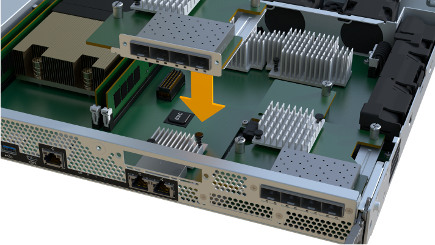

= Add host interface card (HIC) to an EF600
:icons: font
:imagesdir: ../media/

[.lead]
Follow this procedure to add a host interface card (HIC) to an EF600 controller. This addition increases the number of host ports in your storage array.

== About this task

This procedure applies only to EF600 controller shelves, and involves the following steps:

* You must power off the storage array, install the HIC, and reapply power.
* You must repeat all steps to remove the second controller, install the HICs for the second controller, and reinstall the second controller before reapplying power to the controller shelf.

== Before you begin

* Review link:hics-overview-supertask-concept.html[Requirements for EF300 or EF600 HIC upgrades].
* You must schedule a downtime maintenance window for this procedure. You cannot access data on the storage array until you have successfully completed this procedure. Because both controllers must have the same HIC configuration when they are powered on, the power must be off when you install HICs.

CAUTION: *Possible loss of data access* -- Never install a HIC in an EF600 controller canister if that HIC was designed for another E-Series controller. In addition, both controllers and both HICs must be identical. The presence of incompatible or mismatched HICs causes the controllers to lock down when you apply power.

== Step 1: Place controller shelf offline

Place the controller shelf offline so you can safely add the HICs.

===== Steps

. From the Home page of SANtricity System Manager, ensure that the storage array has Optimal status.
+
If the status is not Optimal, use the Recovery Guru or contact technical support to resolve the problem. Do not continue with this procedure.

. Collect support data for your storage array using SANtricity System Manager.
 .. Select *Support* > *Support Center* > *Diagnostics*.
 .. Select *Collect Support Data*.
 .. Click *Collect*.
The file is saved in the Downloads folder for your browser with the name support-data.7z.
. Ensure that no I/O operations are occurring between the storage array and all connected hosts. For example, you can perform these steps:
 ** Stop all processes that involve the LUNs mapped from the storage to the hosts.
 ** Ensure that no applications are writing data to any LUNs mapped from the storage to the hosts.
 ** Unmount all file systems associated with volumes on the array.
+
NOTE: The exact steps to stop host I/O operations depend on the host operating system and the configuration, which are beyond the scope of these instructions. If you are not sure how to stop host I/O operations in your environment, consider shutting down the host.
+
CAUTION: *Possible data loss* -- If you continue this procedure while I/O operations are occurring, the host application might lose access to the data because the storage is not accessible.

. Wait for any data in cache memory to be written to the drives.
+
The green Cache Active LED on the back of each controller is on when cached data needs to be written to the drives. You must wait for this LED to turn off.

. From the Home page of SANtricity System Manager, select *View Operations in Progress*. Wait for all operations to complete before continuing with the next step.
. Power down the controller shelf.
 .. Label and then unplug both power cables from controller shelf.
 .. Wait for all LEDs on the controller shelf to turn off.

== Step 2: Remove controller canister

Remove the controller canister so you can add the new HIC.

===== What you'll need

* Labels to identify each cable that is connected to the controller canister.
* A #1 Phillips screwdriver.
* An ESD wristband, or you have taken other antistatic precautions.
* A flat, static free work area.

===== Steps

. Put on an ESD wristband or take other antistatic precautions.
. Label each cable that is attached to the controller canister.
. Disconnect all the cables from the controller canister.
+
CAUTION: To prevent degraded performance, do not twist, fold, pinch, or step on the cables.

. If the HIC ports use SFP+ transceivers, remove them.
+
Depending on what type of HIC you are adding to, you might be able to reuse these SFPs.

. Confirm that the Cache Active LED on the back of the controller is off.
. Squeeze the handles on either side of the controller, and pull back until it releases from the shelf.
+
image::../media/remove_controller_5.png[]

. Using two hands and the handles, slide the controller canister out of the shelf. When the front of the controller is free of the enclosure, use two hands to pull it out completely.
+
CAUTION: Always use two hands to support the weight of a controller canister.
+
image::../media/remove_controller_6.png[]

. Place the controller canister on a flat, static-free surface.

== Step 3: Add the new HIC

Install the HIC to increase the number of host ports in your storage array.

===== What you'll need

* An ESD wristband, or you have taken other antistatic precautions.
* A #1 Phillips screwdriver.
* Two HICs that are compatible with your controllers.

CAUTION: *Possible loss of data access* -- Never install a HIC in an EF600 controller canister if that HIC was designed for another E-Series controller. In addition, both controllers and both HICs must be identical. The presence of incompatible or mismatched HICs causes the controllers to lock down when you apply power.

===== Steps

. Remove the controller canister's cover by unscrewing the single thumbscrew and lifting the lid open.
. Confirm that the green LED inside the controller is off.
+
If this green LED is on, the controller is still using battery power. You must wait for this LED to go off before removing any components.

. Using a #1 Phillips screwdriver, remove the two screws that attach the HIC faceplate to the controller canister, and remove the faceplate.
. Align the single thumbscrew on the HIC with the corresponding hole on the controller, and align the connector on the bottom of the HIC with the HIC interface connector on the controller card.
+
Be careful not to scratch or bump the components on the bottom of the HIC or on the top of the controller card.

. Carefully lower the HIC into place, and seat the HIC connector by pressing gently on the HIC.
+
CAUTION: *Possible equipment damage* -- Be very careful not to pinch the gold ribbon connector for the controller LEDs between the HIC and the thumbscrew.
+

+
NOTE: The image above is an example of an EF600, the appearance of your HIC may differ.

. Hand-tighten the HIC thumbscrew.
+
Do not use a screwdriver, or you might over tighten the screws.

. Using a #1 Phillips screwdriver, attach the HIC faceplate you removed from the original controller canister to the new controller canister with the two screws.

== Step 4: Reinstall the controller canister

Reinstall the controller canister into the controller shelf after installing the HIC.

===== Steps

. Lower the cover on the controller canister and secure the thumbscrew.
. While squeezing the controller handles, gently slide the controller canister all the way into the controller shelf.
+
NOTE: The controller audibly clicks when correctly installed into the shelf.
+
image::../media/remove_controller_7.png[]

. If removed, install the SFPs into the new HIC and reconnect all the cables.
+
If you are using more than one host protocol, be sure to install the SFPs in the correct host ports.

== Step 5: Complete HIC addition

Place the controller online, collect support data, and resume operations.

===== Steps

. Place controller online.
 .. Plug in power cables.
. As the controller boots, check the controller LEDs.
 ** The amber Attention LED remains on.
 ** The Host Link LEDs might be on, blinking, or off, depending on the host interface.
. When the controller is back online, confirm that its status is Optimal and check the controller shelf's Attention LEDs.
+
If the status is not Optimal or if any of the Attention LEDs are on, confirm that all cables are correctly seated and the controller canister is installed correctly. If necessary, remove and reinstall the controller canister.
+
NOTE: If you cannot resolve the problem, contact technical support.

. Click *Support* > *Upgrade Center* to ensure that the latest version of SANtricity OS is installed.
+
As needed, install the latest version.

. Verify that all volumes have been returned to the preferred owner.
 .. Select *Storage* > *Volumes*. If current owner and preferred owner are not listed select *All volumes* > *Columns*. Select current owner and preferred owner then recheck to verify that volumes are distributed to their perferred owners.
 .. If volumes are all owned by preferred owner continue to Step 6.
 .. If none of the volumes are returned, you must manually return the volumes. Go to *Storage* > *Volumes* > *More* > *Redistribute volumes*.
 .. If only some of the volumes are returned to their preferred owners after auto-distribution or manual distribution you must check the Recovery Guru for host connectivity issues.
 .. If there is no Recovery Guru present or if following the recovery guru steps the volumes are still not returned to their preferred owners contact support.
. Collect support data for your storage array using SANtricity System Manager.
 .. Select *Support* > *Support Center* > *Diagnostics*.
 .. Select *Collect Support Data*.
 .. Click *Collect*.
The file is saved in the Downloads folder for your browser with the name support-data.7z.

== Result

The process of adding a host interface card in your storage array is complete. You can resume normal operations.
