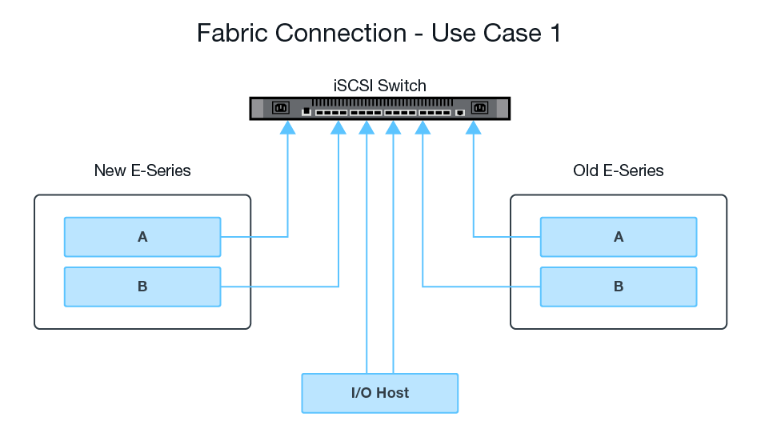
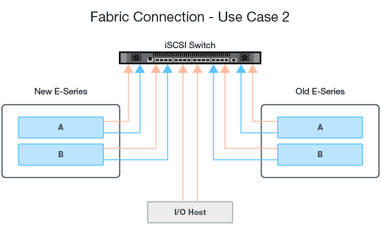

= Configure hardware for Remote Storage Volumes
:icons: font
:imagesdir: ../media/

[.lead]
The E-Series storage system must be configured to communicate with the remote storage system through the supported iSCSI protocol.

== Configure remote storage device and E-Series array

Before proceeding to the SANtricity System Manager to configure the Remote Storage Volumes feature, do the following:

. Manually establish a cabled connection between the E-Series system and the remote storage system such that the two systems can be configured to communicate via iSCSI.
. Configure the iSCSI ports such that the E-Series system and the remote storage system can communicate successfully with each other.
. Obtain the IQN of the E-Series system.
. Make the E-Series system visible to the remote storage system. If the remote storage system is an E-Series system, then create a host using the IQN of the destination E-Series system as the connection information for the host port.
. If the remote storage device is in use by a host/application:
 ** Stop I/O to the remote storage device.
 ** Unmap/unmount the remote storage device.
. Map the remote storage device to the host defined for the E-Series storage system.
. Obtain the LUN number of the device used for the mapping.

NOTE: Recommended: Back up the remote source volume before starting the import process.

== Cable the storage arrays

As part of the setup process, the storage arrays and I/O host must be cabled to the iSCSI-compatible interface.

The following diagrams provide examples of how to cable the systems such that they perform Remote Storage Volume operations over an iSCSI connection.

 

== Configure the iSCSI ports

You must configure the iSCSI ports to ensure communication between the target (local E-Series storage array) and source (remote storage array).

The iSCSI ports can be configured multiple ways based on your subnet. The following are a few examples on how to configure the iSCSI ports for use with the Remote Storage Volumes feature.

[options="header"]
|===
| Source A| Source B| Target A| Target B
a|
10.10.1.100/22
a|
10.10.2.100/22
a|
10.10.1.101/22
a|
10.10.2.101/22
|===
[options="header"]
|===
| Source A| Source B| Target A| Target B
a|
10.10.0.100/16
a|
10.10.0.100/16
a|
10.10.0.101/16
a|
10.10.0.101/16
|===
