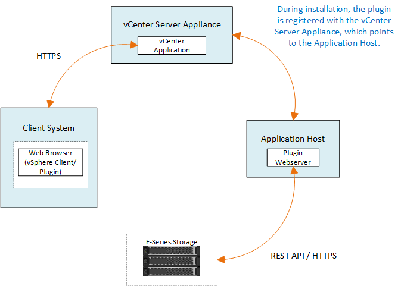

= Overview of the Storage Plugin for vCenter
:hardbreaks:
:nofooter:
:icons: font
:linkattrs:
:imagesdir: ../media/

[.lead]
The SANtricity Storage Plugin for vCenter provides integrated management of E-Series storage arrays from within a VMware vSphere Client session.

== Available tasks

You can use the plugin to perform the following tasks:

* View and manage discovered storage arrays in the network.
* Perform batch operations on groups of multiple storage arrays.
* Perform upgrades on the software OS.
* Import settings from one storage array to another.
* Configure volumes, SSD cache, hosts, host clusters, pools, and volume groups.
* Launch the System Manager interface for additional management tasks on an array.

[NOTE]
The plugin is not a direct replacement for the System Manager interface, which is embedded on each controller for a storage array. System Manager provides additional management features; if desired, you can open System Manager by selecting a storage array in the main view of the plugin and then clicking *Launch*.

The plugin requires a VMware vCenter Server Appliance deployed in the VMware environment and an application host to install and run the plugin webserver.

Refer to the following figure for more information on communications in the vCenter environment.

== Interface overview

When you log in to the plugin, the main page opens to *Manage - All*. From this page, you can view and manage all discovered storage arrays in your network.

=== Navigation sidebar

The navigation sidebar displays the following:

* *Manage* -- Discover storage arrays in your network, launch System Manager for an array, import settings from one array to multiple arrays, manage array groups, upgrade the SANtricity OS, and provision storage.
* *Certificate Management* -- Manage certificates to authenticate between browsers and clients.
* *Operations* -- View the progress of batch operations, such as importing settings from one array to another.

[NOTE]
Some operations are not available when a storage array has a non-optimal status.

* *Support* -- View technical support options, resources, and contacts.

=== Supported browsers

The Storage Plugin for vCenter can be accessed from several types of browsers. The following browsers and versions are supported.

* Google Chrome 89 or later
* Mozilla Firefox 80 or later
* Microsoft Edge 90 or later

=== User roles and permissions

To access tasks in the Storage Plugin for vCenter, the user must have read-write permissions. By default, all defined VMware vCenter user IDs have no permissions to perform tasks in the plugin.

== Configuration overview

Configuration involves the following steps:

. link:san-spvc-ic-installation.html[Install and register the plugin].
. link:san-spvc-ic-user-access.html[Configure plugin access permissions].
. link:san-spvc-ic-login-and-navigation.html[Log in to the plugin interface].
. link:san-spvc-ic-storage-array-discovery.html[Discover storage arrays].
. link:san-spvc-ic-storage-provisioning.html[Provision storage].

== Find more information

For more information about managing datastores in the vSphere Client, see https://docs.vmware.com/en/VMware-vSphere/index.html[VMware vSphere Documentation^].
