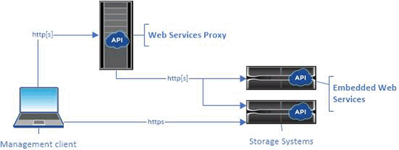
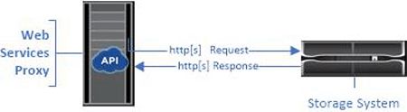

= Overview and requirements
:icons: font
:imagesdir: ../media/

[.lead]
Web Services is an Application Programming Interface (API) that allows you to configure, manage, and monitor NetApp E-Series and EF-Series storage systems. By issuing API requests, you can complete workflows such as configuration, provisioning, and performance monitoring for E-Series storage systems.

When using the Web Services API to manage storage systems, you should be familiar with the following:

* JavaScript Object Notation (JSON) -- Because data within Web Services is encoded through JSON, you should be familiar with JSON programming concepts. For more information, see http://www.json.org/
* Representational state transfer (REST) -- Web Services is a RESTful API that provides access to virtually all the SANtricity management capabilities, so you should be familiar with REST concepts. For more information, see http://www.ics.uci.edu/~fielding/pubs/dissertation/top.htm
* Programming language concepts -- Java and Python are the most common programming languages used with the Web Services API, but any programming language that can make HTTP requests is sufficient for API interaction.

== Implementations

Web Services is available in two implementations:

* Embedded -- A RESTful API server is embedded on each controller of an E2800/EF280 storage system running NetApp SANtricity 11.30 or later versions, an E5700/EF570 running SANtricity 11.40 or later versions, and an EF300 or EF600 running SANtricity 11.60 or later versions. No installation is required.
* Proxy -- The SANtricity Web Services Proxy is a RESTful API server installed separately on a Windows or Linux server. This host-based application can manage hundreds of new and legacy NetApp E-Series storage systems. In general, you should use the proxy for networks with more than 10 storage systems. The proxy can handle numerous requests more efficiently than the embedded API.

The core of the API is available in both implementations.

The following table provides a comparison of the proxy and the embedded version.

[options="header"]
|===
| Consideration| Proxy| Embedded
a|
Installation
a|
Requires a host system (Linux or Windows). The proxy is available for download at the http://mysupport.netapp.com/NOW/cgi-bin/software/?product=E-Series+SANtricity+Web+Services+%28REST+API%29&platform=WebServices[NetApp Support Site] or on https://hub.docker.com/r/netapp/eseries-webservices/[DockerHub].
a|
No installation or enablement required.
a|
Security
a|
Minimal security settings by default.

Security settings are low so that developers can get started with the API quickly and easily. If desired, you can configure the proxy with the same security profile as the embedded version.

a|
High security settings by default.

Security settings are high because the API runs directly on the controllers. For example, it does not allow HTTP access, and it disables all SSL and older TLS encryption protocols for HTTPS.

a|
Central management
a|
Manages all storage systems from one server.
a|
Manages only the controller on which it is embedded.
|===

=== Unified Manager

The proxy installation package includes Unified Manager, a web-based interface that provides configuration access to newer E-Series and EF-Series storage systems, such as the E2800, E5700, EF300, and EF600.

From Unified Manager, you can perform the following batch operations:

* View the status of multiple storage systems from a central view
* Discover multiple storage systems in your network
* Import settings from one storage system to multiple systems
* Upgrade firmware for multiple storage systems

== Compatibility and restrictions

[.lead]
Before installing and using the Web Services Proxy, read the compatibility and restriction information.

The following compatibility and restrictions apply to using the Web Services Proxy.

[options="header"]
|===
| Consideration| Compatibility or restriction
a|
HTTP support
a|
The Web Services Proxy allows use of HTTP or HTTPS. (The embedded version of Web Services requires HTTPS for security reasons.)
a|
Storage systems and firmware
a|
The Web Services Proxy can manage all E-Series storage systems, including a mixture of older systems and the latest E2800, EF280, E5700, EF570, EF300, and EF600 series systems.
a|
IP Support
a|
The Web Services Proxy supports either the IPv4 protocol or IPv6 protocol.

NOTE: The IPv6 protocol might fail when the Web Services Proxy tries to automatically discover the management address from the controller configuration. Possible causes for the failure include problems during IP address forwarding or IPv6 being enabled on the storage systems but not on the server.

a|
NVSRAM file name constraints
a|
The Web Services Proxy uses NVSRAM file names to identify version information accurately. Therefore, you cannot change NVSRAM filenames when they are used with the Web Services Proxy. The Web Services Proxy might not recognize a renamed NVSRAM file as a valid firmware file.
a|
Symbol Web
a|
Symbol Web is a URL in the REST API. It provides access to almost all symbol calls. The symbol function is part of the following URL:

http://host:port/devmgr/storage-system/storage array ID/symbol/symbol function

NOTE: Symbol-disabled storage systems are supported through the Web Services Proxy.

|===

== API basics

[.lead]
In the Web Services API, HTTP communications involve a request-response cycle.

=== URL elements in requests

Regardless of the programming language or tool used, each call to the Web Services API has a similar structure, with a URL, HTTP verb, and an Accept header.

All requests include a URL, as in the following example, and contain the elements described in the table.

`+https://webservices.name.com:8443/devmgr/v2/storage-systems+`

[options="header"]
|===
| Area| Description
a|
HTTP transport

https://

a|
The Web Services Proxy enables the use of HTTP or HTTPS.

The embedded Web Services requires HTTPS for security reasons.

a|
Base URL and port

webservices.name.com:8443

a|
Each request must be correctly routed to an active instance of Web Services. The FQDN (fully qualified domain name) or the IP address of the instance is required, along with the listening port. By default, Web Services communicates over port 8080 (for HTTP) and port 8443 (for HTTPS).

For the Web Services Proxy, both ports can be changed during the proxy installation or in the wsconfig.xml file. Port contention is common on data center hosts running various management applications.

For the embedded Web Services, the port on the controller cannot be changed; it defaults to port 8443 for secure connections.

a|
API path

devmgr/v2/storage-systems

a|
A request is made to a specific REST resource or endpoint within the Web Services API. Most endpoints are in the form of:

devmgr/v2/<resource>/[id]

The API path consists of three parts:

* devmgr (Device Manager) is the namespace of the Web Services API.
* V2 denotes the version of the API that you are accessing. You can also use utils to access login endpoints.
* storage-systems is a category within the documentation.

|===

=== Supported HTTP verbs

Supported HTTP verbs include GET, POST, and DELETE:

* GET requests are used for read-only requests.
* POST requests are used to create and update objects, and also for read requests that might have security implications.
* DELETE requests are typically used to remove an object from management, remove an object entirely, or to reset the state of the object.

NOTE: Currently, the Web Services API does not support PUT or PATCH. Instead, you can use POST to provide the typical functionality for these verbs.

=== Accept headers

When returning a request body, Web Services returns the data in JSON format (unless otherwise specified). Certain clients default to requesting "`text/html`" or something similar. In these cases, the API responds with an HTTP code 406, denoting that it cannot provide data in this format. As a best practice, you should define the Accept header as "`application/json`" for any cases in which you expect JSON as the response type. In other cases where a response body is not returned (for example, DELETE), providing the Accept header does not cause any unintended effects.

=== Responses

When a request is made to the API, a response returns two critical pieces of information:

* HTTP status code -- Indicates whether the request was successful.
* Optional response body -- Usually provides a JSON body representing the state of the resource or a body providing more details on the nature of a failure.

You must check the status code and the content-type header to determine what the resulting response body looks like. For HTTP status codes 200-203 and 422, Web Services returns a JSON body with the response. For other HTTP status codes, Web Services generally does not return an additional JSON body, either because the specification does not allow it (204) or because the status is self-explanatory. The table lists common HTTP status codes and definitions. It also indicates whether information associated with each HTTP code is returned in a JSON body.

[options="header"]
|===
| HTTP status code| Description| JSON body
a|
200 OK
a|
Denotes a successful response.
a|
Yes
a|
201 Created
a|
Indicates that an object was created. This code is used in a few rare cases instead of a 200 status.
a|
Yes
a|
202 Accepted
a|
Indicates that the request is accepted for processing as an asynchronous request, but you must make a subsequent request to get the actual result.
a|
Yes
a|
203 Non-Authoritative Information
a|
Similar to a 200 response, but Web Services cannot guarantee that the data is up-to-date (for example, only cached data is available at this time).
a|
Yes
a|
204 No Content
a|
Indicates a successful operation, but there is no response body.
a|
No
a|
400 Bad Request
a|
Indicates that the JSON body provided in the request is not valid.
a|
No
a|
401 Unauthorized
a|
Indicates that an authentication failure has occurred. Either no credentials were provided, or the username or password was invalid.
a|
No
a|
403 Forbidden
a|
An authorization failure, which indicates that the authenticated user does not have permission to access the requested endpoint.
a|
No
a|
404 Not Found
a|
Indicates that the requested resource could not be located. This code is valid for nonexistent APIs or nonexistent resources requested by the identifier.
a|
No
a|
422 Unprocessable Entity
a|
Indicates the request is generally well-formed, but either the input parameters are invalid, or the state of the storage system does not allow Web Services to satisfy the request.
a|
Yes
a|
424 Failed Dependency
a|
Used in the Web Services Proxy to indicate that the requested storage system is currently inaccessible. Therefore, Web Services cannot satisfy the request.
a|
No
a|
429 Too Many Requests
a|
Indicates that a request limit was exceeded and should be retried at a later time.
a|
No
|===

=== Sample scripts

GitHub contains a repository for the collection and organization of sample scripts illustrating the use of the NetApp SANtricity Web Services API. To access the repository, see: https://github.com/NetApp/webservices-samples.

== Terms and concepts

[.lead]
The following terms apply to the Web Services Proxy.

[options="header"]
|===
| Term| Definition
a|
API
a|
An Application Programming Interface (API) is a set of protocols and methods that enables developers to communicate with devices. The Web Services API is used to communicate with E-Series storage systems.
a|
ASUP
a|
The AutoSupport (ASUP) feature collects data in a customer support bundle and automatically sends the message file to technical support for remote troubleshooting and problem analysis.
a|
Endpoint
a|
Endpoints are functions that are available through the API. An endpoint includes an HTTP verb, plus the URI path. In Web Services, endpoints can execute such tasks as discovering storage systems and creating volumes.
a|
HTTP Verb
a|
An HTTP verb is a corresponding action for an endpoint, such as retrieving and creating data. In Web Services, HTTP verbs include POST, GET, and DELETE.
a|
JSON
a|
JavaScript Object Notation (JSON) is a structured data format much like XML, which uses a minimal, readable format. Data within Web Services is encoded through JSON.
a|
REST / RESTful
a|
Representational state transfer (REST) is a loose specification that defines an architectural style for an API. Because most REST APIs do not fully adhere to the specification, they are described as "`RESTful`" or "`REST-like.`" Generally, a "`RESTful`" API is agnostic to programming languages and has the following characteristics:

* HTTP-based, which follows the general semantics of the protocol
* Producer and consumer of structured data (JSON, XML, etc.)
* Object-oriented (as opposed to operation-oriented)

Web Services is a RESTful API that provides access to virtually all the SANtricity management capabilities.

a|
storage system
a|
A storage system is an E-Series array, which includes shelves, controllers, drives, software, and firmware.
a|
SYMbol API
a|
SYMbol is a legacy API for managing E-Series storage systems. The underlying implementation of the Web Services API uses SYMbol.
a|
Web Services
a|
Web Services is an API that NetApp designed for developers to manage E-Series storage systems. There are two implementations of Web Services: embedded on the controller and a separate proxy that can be installed on Linux or Windows.
|===
